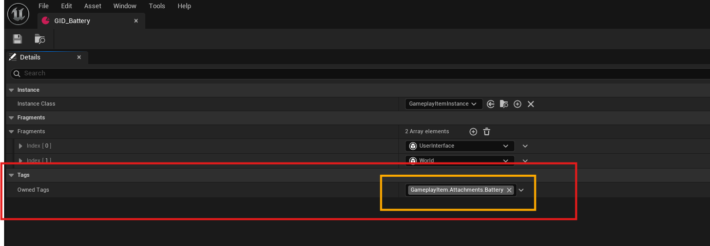
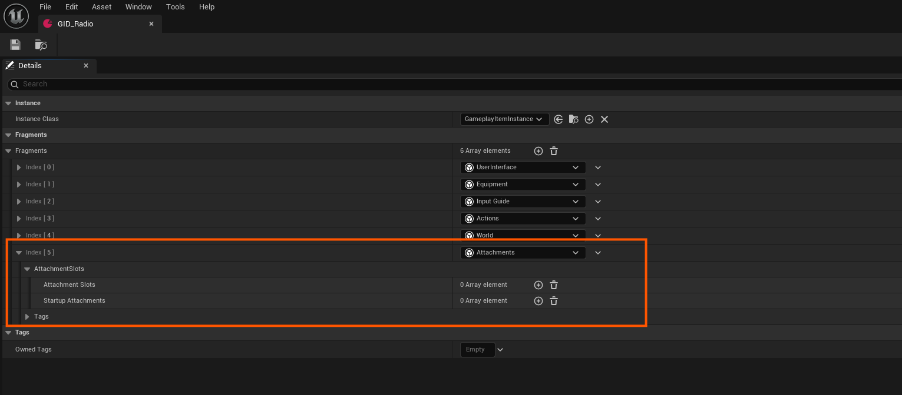
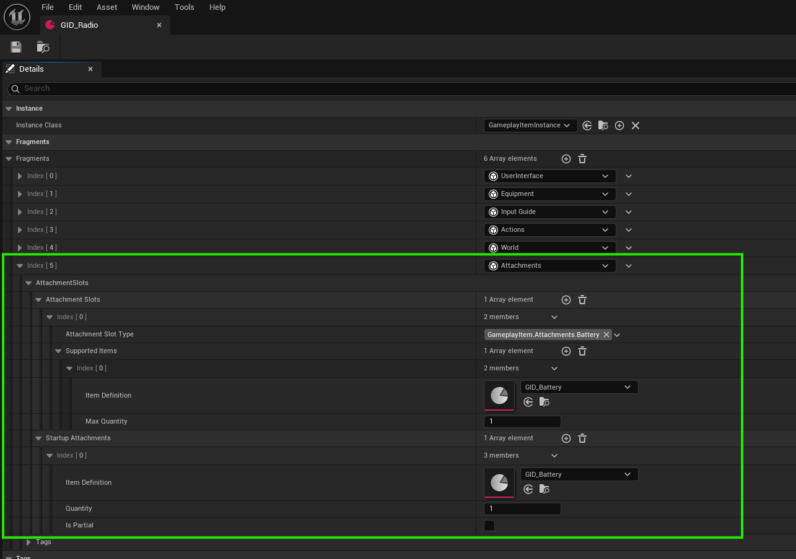
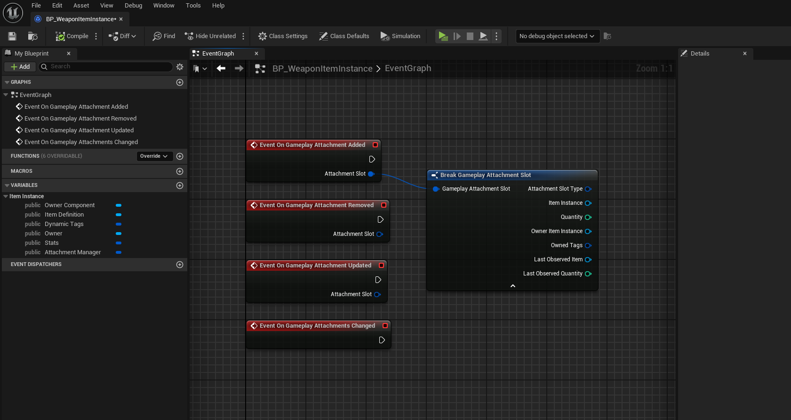
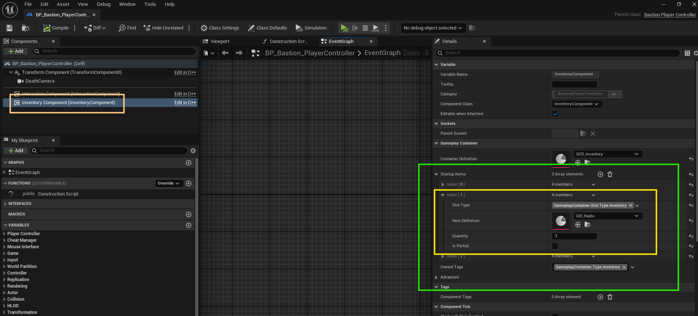

# Creating And Configuring Attachments

This guide explains how to set up attachments for items using item definition data assets. Attachments allow items (like weapons) to support modular add-ons such as scopes, barrels, or accessories.

---

## 1. Create or Use an Existing Item Definition

Start by creating a new item definition or using an existing one (e.g., a weapon item).  
If you’re not sure how to create an item definition, refer to the [Creating New Items](creating-new-items).

Next, you'll need to:

1. **Create a new item definition for each attachment** you want to add to the main item (e.g., scope, battery, suppressor).
2. **Assign the appropriate attachment slot type tag** to the **Owned Tags** of each attachment item.  
   This tag defines **where** the item can be attached. Without the correct tag, the item **won’t attach**.

:::tip Example
If you want to attach a **Battery** item to a **Radio**, ensure the **Battery** item has a tag (e.g., `GameplayItem.Attachments.Battery`) that matches the **Battery** attachment slot on the Radio or your main item attachment slot type.
:::

:::note
You can create new tags as needed following this format `GameplayItem.Attachments.{YOUR_SLOT_NAME}`
:::

---

## 2. Add an Attachments Fragment

Once you have your main item definition and attachments items definitions:

- Add an **Attachments Fragment** to the main item (e.g., for a weapon).
- This fragment enables the item to accept attachments.

---

## 3. Configure the Attachments Fragment

Now, set up how the main item handles attachments by adding **Attachment Slots**:

Each slot configuration includes:

| Property | Description |
|----------|-------------|
| **Attachment Slot Type** | Identifies the slot type (e.g., `Scope`, `Muzzle`, `Magazine`). |
| **Supported Items Definitions** | Specifies which items can be attached in that slot. |
| **Max Quantity** | Defines how many of that attachment can be added to the slot. |
| **Startup Attachments** | Indicates which attachments should be added or attached to the main item when it gets created. |

:::info
In **Startup Attachments**, if `Is Partial` is checked, the system will attempt to attach *any possible quantity* of the item to the main item when it gets created — not necessarily meeting the specified quantity.  
If `Is Partial` is **not** checked, it will only attach the **exact specified quantity**. If that operation fails nothing will be attached.
:::

### 🔒 Quantity Rules

- The **max quantity**:
  - Cannot exceed the **attachment item’s max stack size**.
  - Should be between `1` and the **max stack size** of the attached item.
  - Can also be explicitly defined, as long as it doesn’t exceed the attached item’s stack size.

> If a Magazine has a `Bullets` attachment slot, you might allow only 30 bullet items to be attached, and it must be from a list of supported item definitions.

---

## 4. Handling Attachment Logic in Item Instances

Once you’ve configured your attachments, you can define how your main item reacts when attachments are added, removed, or updated.

You have two main options:

- **Use a general-purpose item instance** (Blueprint or C++) to handle all attachment logic for similar items.
- **Create specific item instances Blueprints or C++ classes** for each item (e.g., per weapon), then assign them in the corresponding item definitions.

> All item instances should inherit from `GameplayItemInstance` base class and these item instances will be used automatically when an item is created.

---

### Handling Attachment Events

You can respond to the following **attachment-related events** in your item instance class:

- **On Attachment Added**
- **On Attachment Removed**
- **On Attachment Updated**
- **On Attachments Changed**

Common use cases include:

- Setting or swapping **static meshes or skeletal parts** on the **Gameplay Equipment Actor** (e.g., adding a scope or suppressor mesh).
- Modifying **item stats** based on the stats or tags of the attached items.
- Applying or removing **Gameplay Effects** when attachments change.
- Overriding attachment behavior for specific items.

---

### Gameplay Equipment Actor

The **Gameplay Equipment Actor** is an actor spawned when an item (like a weapon) is equipped. It requires the item to have an **Equipment Fragment**.

To support custom logic:

- You can create **custom equipment actor classes** that inherit from the base equipment actor.
- Add specific logic or components related to attachments in those child classes.
- Keep core logic centralized in the item instance to maintain consistency across weapons.

---

### Optional: Base Classes for Weapons

If you’re working with multiple weapon items, consider creating a **child item instance base class** specifically for weapons (e.g., `WeaponItemInstance`).

This allows you to:

- Centralize weapon-specific logic such as:
  - Shooting behavior
  - Trace or sweep-based hit detection
  - Recoil tuning
  - Damage modifiers
- Keep your code modular, reusable, and easier to maintain.
- Add shared functionality for all weapon items while allowing for per-weapon customization via further child classes.

---

## 5. Testing Attachments In-Game

After setting up your items and attachment logic, you can now test them in-game.

There are two ways to test attachments:

- **Auto Attach on Startup**  
  If you've configured **Startup Attachments**, these will automatically attach to the item when it's created (e.g., when added to the inventory or spawned).

- **Manual Attach/Detach via UI**  
  Use your in-game inventory UI to manually:
  
  - **Attach** supported items to available attachment slots by **dragging the attachment item and dropping it over the main item** that supports attachments.
  
  - **Detach** attachments in one of the following ways:
    - **Alt + Right-Click** the main item to open the context menu, then select **"Detach All Items"**.  
      > This requires the main item to have an **Actions Fragment** with the **Detach All Items** action added.  

      > (This input is the default in the *Unify Project*, but may differ in your setup.)
    
    - **Control + Left-Click** the main item to open the **attachments menu**, allowing for manual detachment.  
      > - **Click on an attached item** to detach it and return it to the container (e.g., inventory) where the main item exists.
      > - **Click the button at the bottom of each attachment slot** to see a list of compatible attachments.  
      >   Selecting any of these will automatically attach it to the main item in that slot.

      > (This input is the default in the *Unify Demo Project*, but may also differ depending on your configuration.)

Observe how the item responds to these actions — visually, statistically, or via gameplay effects — and confirm that attachment behavior is working as intended.

---

> ✅ Make sure to check that attachment limits, compatibility rules, and item behaviors work as expected when testing.

