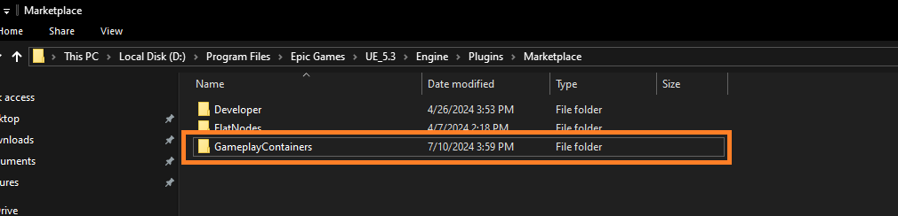
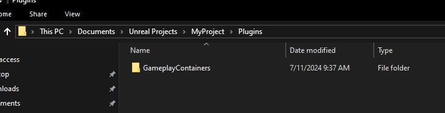
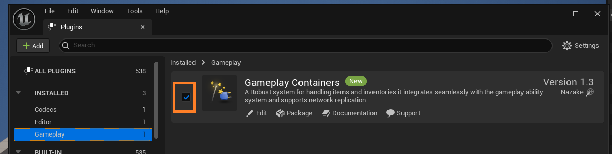
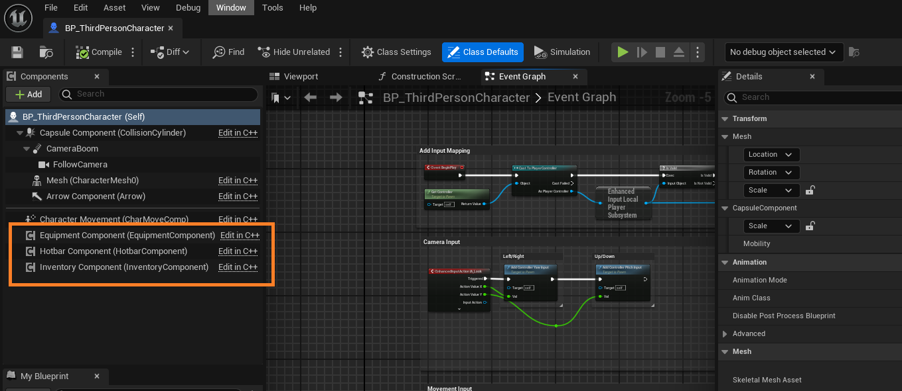

# Setup


### Downloading and Locating the Gameplay Containers Plugin

---

## Step 1: Download the Plugin
Download the **Gameplay Containers** plugin from the **Epic Games Launcher** for the version of Unreal Engine you wish to use (5.1 and above).

---

## Step 2: Locate the Plugin
After downloading, you can find the plugin in the following directory:
`{EngineDirectory}/Plugins/Marketplace/GameplayContainers`



---

## Step 3: Copy the Plugin to Your Project
- Make sure your project is closed (both IDE and editor are not running).
- Copy the **GameplayContainers** plugin folder from the directory above and paste it inside the **Plugins** folder in your project.
  
:::note  
If the **Plugins** folder does not already exist in your project, create it first, and then paste the **GameplayContainers** folder inside.
:::



- Right click on your unreal project file and click `Generate Visual Studio Project Files`

---

## Step 4: Enable the Plugin in Unreal Editor
- Open your project in the **Unreal Editor**.
- Navigate to **Edit > Plugins > Gameplay category**.
- Ensure that the **Gameplay Containers** plugin is enabled. If it is not, click the enable checkbox to the left, and you may be prompted to restart the editor.



:::note
Also, make sure the **Gameplay Abilities**, **Enhanced Input** and **Common UI** plugins are enabled in your project.
:::

---

## Step 5: Open Your Project In Your IDE

:::note
If your project is a **Blueprint-only** project (without C++ code), you will need to perform the necessary steps to convert it into a **C++ project**.
usually creating any empty C++ class will do it.
:::

- Now that your project is open in the IDE, navigate to Games > YourProject > Source > YourProject > YourProject.Build.cs file.
- Make sure to add GameplayContainers, GameplayAbilities, CommonUI, EnhancedInput to your Build.cs file

```c
public MyProject(ReadOnlyTargetRules Target) : base(Target)
{
    PCHUsage = PCHUsageMode.UseExplicitOrSharedPCHs;
        
    PublicDependencyModuleNames.AddRange(new string[]
    {
        "Core", 
        "Engine", 
        "InputCore", 
        "CoreUObject", 

        "CommonUI",
        "GameplayTags",
        "EnhancedInput",
        "GameplayAbilities",   
        "GameplayContainers"
    });

    PrivateDependencyModuleNames.AddRange(new string[]
    {
        "UMG", 
        "Slate", 
        "SlateCore",
    });
}
```
- Click "Save All" in your IDE, then close the IDE and Unreal Engine Editor. Next, navigate to your project folder, right-click your Unreal project file, and choose "Generate Visual Studio project files."

- Now, open the project in your IDE again by double-clicking on the YourProject file (not the Unreal Engine editor file, but the one for your IDE such as Visual Studio or JetBrains Rider).

---

## Step 6: Implementation & Initialization

:::note
Assuming you already have created C++ classes for **Character**, **PlayerController** and **PlayerState**
:::

- Let's start by setting up the ability system component, in this case its going to be in the PlayerState class (you can also put it in the character or pawn class if you want to).

### PlayerState Implementation

```cpp
#pragma once

#include "CoreMinimal.h"
#include "AbilitySystemInterface.h"
#include "GameFramework/PlayerState.h"
#include "MyPlayerState.generated.h"

class UAbilitySystemComponent;

UCLASS()
class MYPROJECT_API AMyPlayerState : public APlayerState, public IAbilitySystemInterface 
{
	GENERATED_BODY()

public:

	AMyPlayerState();

	virtual void BeginPlay() override;
	virtual void PostInitializeComponents() override;

	//~ IAbilitySystemInterface
	virtual UAbilitySystemComponent* GetAbilitySystemComponent() const override;
	//~ IAbilitySystemInterface

	UFUNCTION(BlueprintPure, Category = "Unify|PlayerState")
	UAbilitySystemComponent* GetMyAbilitySystemComponent() const;

	UPROPERTY(VisibleDefaultsOnly, BlueprintReadOnly, Category = "Unify|PlayerState")
	TObjectPtr<UAbilitySystemComponent> AbilitySystemComponent;
	
};
```

```cpp
#include "MyPlayerState.h"
#include "AbilitySystemComponent.h"

AUnifyPlayerState::AUnifyPlayerState()
{
	// Create ability system component
	AbilitySystemComponent = CreateDefaultSubobject<UAbilitySystemComponent>(TEXT("AbilitySystemComponent"));
	AbilitySystemComponent->SetReplicationMode(EGameplayEffectReplicationMode::Mixed); // Use Full mode for single player games and Minimal for AI
	AbilitySystemComponent->SetIsReplicated(true);

	// AbilitySystemComponent needs to be updated at a high frequency.
	NetUpdateFrequency = 100.0f;
}

void AMyPlayerState::BeginPlay()
{
	Super::BeginPlay();
}

void AMyPlayerState::PostInitializeComponents()
{
	Super::PostInitializeComponents();
}

UAbilitySystemComponent* AMyPlayerState::GetAbilitySystemComponent() const
{
	return AbilitySystemComponent;
}

UAbilitySystemComponent* AMyPlayerState::GetMyAbilitySystemComponent() const
{
	return AbilitySystemComponent;
}
```

### Character Implementation & GAS Initialization

:::info
Initialization of Gameplay Containers requires the Gameplay Ability System to be initialized. Therefore, you will need to add the Gameplay Container components (Inventory, Hotbar, Equipment, etc..) from C++. (Unless you expose the required initialization functions to blueprint, which is beyond the scope of this guide).
:::

- Now, let's initialize the ability system and add an Inventory, Hotbar, and Equipment components to our Character. In this example, we will use the Character class for all of them to keep it simple.


```cpp
UCLASS()
class MYPROJECT_API AMyCharacter : public ACharacter, public IAbilitySystemInterface, public IGameplayContainerInterface, public IGameplayEquipmentInterface, public IGameplayContainerUserInterface
{
	GENERATED_BODY()

public:

	AMyCharacter(const FObjectInitializer& ObjectInitializer);
	
	//~ IAbilitySystemInterface
	virtual UAbilitySystemComponent* GetAbilitySystemComponent() const override;
	//~ IAbilitySystemInterface

	virtual void PossessedBy(AController* NewController) override;
	virtual void UnPossessed() override;

	virtual void OnRep_PlayerState() override;


	virtual TArray<UGameplayContainerComponent*> GetAllContainers() override;
	virtual UInventoryComponent* GetInventoryComponent() override;
	virtual UHotbarComponent* GetHotbarComponent() override;
	virtual UEquipmentComponent* GetEquipmentComponent() override;

	virtual void OnContainerUserRegistered(const FGameplayContainerUser& User) override;
	virtual void OnContainerUserUnregistered(const FGameplayContainerUser& User) override;
	virtual void OnContainerUserInfoChanged(const FGameplayContainerUser& User) override;

        virtual UMeshComponent* GetMeshComponentByTag(FName ComponentTag) const override;
        virtual void OnItemEquipped(const UGameplayItemDefinition* Item) override;
        virtual void OnItemUnequipped(const UGameplayItemDefinition* Item) override;

	UFUNCTION(BlueprintPure, Category = "MyCharacter")
	virtual UGameplayContainerComponent* GetActiveContainerComponent() override;


	UPROPERTY(VisibleAnywhere, BlueprintReadOnly, meta = (AllowPrivateAccess = true), Category = "MyCharacter")
	TObjectPtr<UInventoryComponent> InventoryComponent;

	UPROPERTY(VisibleAnywhere, BlueprintReadOnly, meta = (AllowPrivateAccess = true), Category = "MyCharacter")
	TObjectPtr<UHotbarComponent> HotbarComponent;

        UPROPERTY(VisibleAnywhere, BlueprintReadOnly, meta = (AllowPrivateAccess = true), Category = "MyCharacter")
	TObjectPtr<UPawnEquipmentComponent> EquipmentComponent;

	UPROPERTY(BlueprintReadOnly, meta = (AllowPrivateAccess = true), Category = "MyCharacter")
	TObjectPtr<UGameplayContainerComponent> ActiveContainer;
	
};
```

```cpp
#include "MyCharacter.h"
#include "AbilitySystemComponent.h"
#include "GameFramework/Controller.h"
#include "GameFramework/PlayerState.h"
#include "Items/Fragments/GameplayItemFragment_Equipment.h"
#include "Core/Equipment/PawnEquipmentComponent.h"
#include "Core/Inventory/InventoryComponent.h"
#include "Core/Hotbar/HotbarComponent.h"
#include "GameplayContainerTags.h"


AMyCharacter::AMyCharacter(const FObjectInitializer& ObjectInitializer) : Super(ObjectInitializer)
{
    InventoryComponent = CreateDefaultSubobject<UInventoryComponent>(TEXT("InventoryComponent"));
    InventoryComponent->SetIsReplicated(true);

    HotbarComponent = CreateDefaultSubobject<UHotbarComponent>(TEXT("HotbarComponent"));
    HotbarComponent->SetIsReplicated(true);

    EquipmentComponent = CreateDefaultSubobject<UPawnEquipmentComponent>(TEXT("EquipmentComponent"));
    EquipmentComponent->SetIsReplicated(true);
}


UAbilitySystemComponent* AMyCharacter::GetAbilitySystemComponent() const
{
    if (AMyPlayerState* PS = GetPlayerState<AMyPlayerState>())
    {
        return PS->GetAbilitySystemComponent();
    }
        
    return nullptr;
}

void AMyCharacter::PossessedBy(AController* NewController)
{
    Super::PossessedBy(NewController);

    if (AMyPlayerState* PS = GetPlayerState<AMyPlayerState>())
    {
        PS->GetAbilitySystemComponent()->InitAbilityActorInfo(PS, /*Avatar*/ this);
        
        InventoryComponent->RegisterWithAbilitySystem(GetAbilitySystemComponent());
        HotbarComponent->RegisterWithAbilitySystem(GetAbilitySystemComponent());
        EquipmentComponent->RegisterWithAbilitySystem(GetAbilitySystemComponent());
    }
}

void AMyCharacter::UnPossessed()
{
    if (AMyPlayerState* PS = GetPlayerState<AMyPlayerState>())
    {
        InventoryComponent->UnregisterAbilitySystem();
        HotbarComponent->UnregisterAbilitySystem();
        EquipmentComponent->UnregisterAbilitySystem();
        
        PS->GetAbilitySystemComponent()->ClearAllAbilities();
        PS->GetAbilitySystemComponent()->ClearActorInfo();
    }

    Super::PossessedBy(NewController);
}

void AMyCharacter::OnRep_PlayerState()
{
    Super::OnRep_PlayerState();

    if (AMyPlayerState* PS = GetPlayerState<AMyPlayerState>())
    {
        PS->GetAbilitySystemComponent()->InitAbilityActorInfo(PS, /*Avatar*/ this);
        
        InventoryComponent->RegisterWithAbilitySystem(GetAbilitySystemComponent());
        HotbarComponent->RegisterWithAbilitySystem(GetAbilitySystemComponent());
        EquipmentComponent->RegisterWithAbilitySystem(GetAbilitySystemComponent());
    }
}

TArray<UGameplayContainerComponent*> AMyCharacter::GetAllContainers() 
{
    TArray<UGameplayContainerComponent*> Containers;

    Containers.Add(InventoryComponent);
    Containers.Add(HotbarComponent);
    Containers.Add(EquipmentComponent);

    return Containers;
}

UInventoryComponent* AMyCharacter::GetInventoryComponent()
{
    return InventoryComponent;
}

UHotbarComponent* AMyCharacter::GetHotbarComponent()
{
    return HotbarComponent;
}

UEquipmentComponent* AMyCharacter::GetEquipmentComponent()
{
    return EquipmentComponent;
}

void AMyCharacter::OnContainerUserRegistered(const FGameplayContainerUser& User)
{
    if (const APlayerController* PC = User.GetAbilitySystemComponent()->AbilityActorInfo.Get()->PlayerController.Get())
    {
        if (PC == this)
        {
            ActiveContainer = User.GetTargetContainer();
        }
    }
}

void AMyCharacter::OnContainerUserUnregistered(const FGameplayContainerUser& User)
{
    if (const APlayerController* PC = User.GetAbilitySystemComponent()->AbilityActorInfo.Get()->PlayerController.Get())
    {
        if (PC == this)
        {
            ActiveContainer = nullptr;
        }
    }
}

void AMyCharacter::OnContainerUserInfoChanged(const FGameplayContainerUser& User)
{
    if (const APlayerController* PC = User.GetAbilitySystemComponent()->AbilityActorInfo.Get()->PlayerController.Get())
    {
        if (PC == this)
        {
            ActiveContainer = User.GetTargetContainer();
        }
    }
}

UGameplayContainerComponent* AMyCharacter::GetActiveContainerComponent() 
{
    return ActiveContainerComponent;
}

// This part below is for equippable items 

UMeshComponent* AMyCharacter::GetMeshComponentByTag(const FName ComponentTag) const
{
    return Cast<UMeshComponent>(FindComponentByTag(UMeshComponent::StaticClass(), ComponentTag));
}

void AMyCharacter::OnItemEquipped(const UGameplayItemDefinition* Item)
{
    if (Item)
    {
        // You can also swap equipment meshes here if you want to
        
        const TSubclassOf<UAnimInstance> AnimLayer_FirstPerson = Item->GetFragmentByClass<UGameplayItemFragment_Equipment>()->GetEquipmentDefinition()->GetAnimationLayerInfoByTag(GameplayContainerTags::TAG_Perspective_FirstPerson_Equipment_AnimationLayer_Equipped).AnimationLayerClass;
        const TSubclassOf<UAnimInstance> AnimLayer_ThirdPerson = Item->GetFragmentByClass<UGameplayItemFragment_Equipment>()->GetEquipmentDefinition()->GetAnimationLayerInfoByTag(GameplayContainerTags::TAG_Perspective_ThirdPerson_Equipment_AnimationLayer_Equipped).AnimationLayerClass;

        if (UAnimInstance* MyAnimInstance = YourFirstPersonMesh->GetAnimInstance())
        {
            MyAnimInstance->LinkAnimClassLayers(AnimLayer_FirstPerson);
        }
        
        if (const USkeletalMeshComponent* MyMesh = GetMesh())
        {
            if (UAnimInstance* MyAnimInstance = MyMesh->GetAnimInstance())
            {
                MyAnimInstance->LinkAnimClassLayers(AnimLayer_ThirdPerson);
            }
        }
    }
}

void AMyCharacter::OnItemUnequipped(const UGameplayItemDefinition* Item)
{
    if (Item)
    {
        // You can also swap equipment meshes here if you want to

        const TSubclassOf<UAnimInstance> AnimLayer_FirstPerson = Item->GetFragmentByClass<UGameplayItemFragment_Equipment>()->GetEquipmentDefinition()->GetAnimationLayerInfoByTag(GameplayContainerTags::TAG_Perspective_FirstPerson_Equipment_AnimationLayer_Unequipped).AnimationLayerClass;
        const TSubclassOf<UAnimInstance> AnimLayer_ThirdPerson = Item->GetFragmentByClass<UGameplayItemFragment_Equipment>()->GetEquipmentDefinition()->GetAnimationLayerInfoByTag(GameplayContainerTags::TAG_Perspective_ThirdPerson_Equipment_AnimationLayer_Unequipped).AnimationLayerClass;

        if (UAnimInstance* MyAnimInstance = YourFirstPersonMesh->GetAnimInstance())
        {
            MyAnimInstance->LinkAnimClassLayers(AnimLayer_FirstPerson);
        }
        
        if (const USkeletalMeshComponent* MyMesh = GetMesh())
        {
            if (UAnimInstance* MyAnimInstance = MyMesh->GetAnimInstance())
            {
                MyAnimInstance->LinkAnimClassLayers(AnimLayer_ThirdPerson);
            }
        }
    }
}
```

:::warning Avoid Circular Dependency Issues

To prevent circular dependency issues in your project, it is recommended to **move the ability classes, ability costs** from the plugin source folder:

```
Plugins/GameplayContainers/Source/GameplayContainers/Public/Core/Abilities
```

...into your **project source directory** where you have your own abilities.

Alternatively, you can:

- **Copy the ability and cost classes**
- **Rename them** appropriately in your project
- Use these copies instead of referencing the original plugin ability classes

> You can also move or copy the attributes if needed otherwise you can extend them inside the plugin source.

This approach is especially useful if:

- You have your **own subclass** of `UGameplayAbility`
- You have your **own costs** for abilities
- You want your abilities and costs to **work consistently** with your project-specific code
- You want to **avoid reparenting** plugin classes directly, which often leads to circular dependencies and other complications

By using your own project-local versions of the abilities and costs, you ensure better integration and avoid tight coupling with the plugin.

:::

- Everything should now be ready on the C++ side. Let's Compile and proceed to set up and configure the rest in the editor. Press the compile button again to compile the project code and run the Unreal Engine Editor.

:::note
Make sure your blueprints for **Character** and **PlayerState** are using the C++ classes we just created. If not reparent them to use the C++ classes.
:::

## Step 7: Blueprint Configuration

- Starting with the inventory component make sure the container definition for each component is selected correctly.




:::note
Startup Items allows you to specify which items should be added to the container initially when the game starts.
You can also check advanced section to configure more advanced settings.
:::


- Now, let's add the input mapping context of the Gameplay Container plugin to the player. I do this in the Begin Play function for this project, adding it after the default player mapping context.


- Now, let's implement the Hotbar component input actions. By default, the Hotbar has 6 slots, so I've added 6 input actions. You can adjust the number of slots and input actions as needed.

:::note
the slot index always starts from 0 so for the first slot its 0 and last slot is (N - 1) and N is the number of slots.
:::

:::info
The ToggleSlot function is maintained for older plugin versions; the new function is now called ToggleSlotByIndex.
:::


- Next, go to the `Gameplay Containers` plugin, navigate to `Core > Abilities` folder, and verify the abilities settings. Make sure the abilities blueprints inherit from your project's main Gameplay Ability class. If you don't have a main Gameplay Ability class for your project, you can reparent them to use the default Gameplay Ability class.

:::info
I created a script to reparent all selected gameplay abilities blueprints located in `Plugins > GameplayContainers > Editor > Scripts`.
:::

- To use the script, select all gameplay abilities, right-click, choose "Scripted Asset Actions," select "Reparent Selected Blueprints," then choose the new parent class and press OK.


- Next, give all the abilities from the Gameplay Containers plugin to your player character to enable usage of the inventory, hotbar, equipment components, etc.

- Create a variable of type Gameplay Ability Class and make it an array. This variable will hold all the abilities that should be added to our player's Ability System component on Begin Play.

- Add all the ability from `GameplayContainers` plugin in `Core/Abilities` to this array of gameplay ability classes.

- On BeginPlay in PlayerState (or wherever the Ability System Component is), use a foreach loop to call the GiveAbility function for each element in the array.

:::info
If your game project utilizes ability sets, I have a script that can assist in adding all abilities to the set, provided its structure matches that of the demo project. You can find the script in the `GameplayContainer` plugin under `Editor > Scripts` in the `Utility_AddSelectedAbilitiesToAbilitySet` folder.
:::

- This script example demonstrates how to populate the ability set with gameplay container abilities, which you can then grant to your player.


:::note
It is recommended to edit the script to match your project's specific ability set, as it is initially configured for the demo project. Simply replace the default class with your project's class for ability sets.
:::

- Select your ability set data asset and click OK to automatically populate the abilities.

## Step 8: Testing 

- Now, simply add the `W_Hotbar` widget to your HUD and set up a button that toggles the `W_InventoryWindow` widget to view your inventory and other containers.

## Unify Demo Project

- Check out the unify demo project for detailed information and simplified testing setup.
[Click Here](https://github.com/imnazake/Unify)