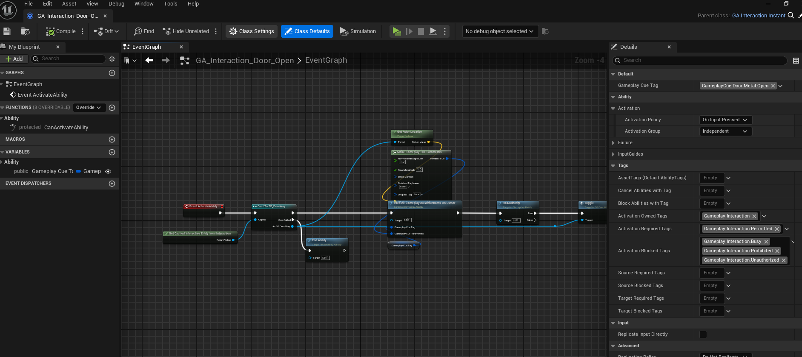

# Creating New Interaction Abilities

This guide walks you through the process of creating and configuring **Interaction Abilities** for the **Gameplay Interaction Plugin**. Interaction abilities define specific actions players can perform when interacting with specific entities and are attached to **Interaction Options** to control how interactions behave.

---

### 1. **Create a New Interaction Ability Blueprint**

To begin, you will need to create a new Interaction Ability Blueprint. This Blueprint will define the functionality for your interaction ability.

- In Unreal Engine, navigate to the **Content Browser**.
- Right-click in the directory where you want to store the new Blueprint.
- Select **Blueprint Class**.
- You can choose between two built-in types as the parent class of the new interaction ability:
    - **Instant Interaction** : `GA_Interaction_Instant`
    - **Timed Interaction** : `GA_Interaction_Timed`
- Name your new Blueprint (e.g., `GA_Interaction_Door_Open`).

> These base Gameplay Ability classes can be found in the plugin content folder:  
> `Core/Abilities/Templates`

:::info
You may also create custom interaction ability types if needed.
:::

---

### 2. **Define Ability Logic**

Once you've created the Interaction Ability Blueprint, you can begin defining its behavior. 
This is done within the Blueprint's event graph and various functions.

- Open the newly created Interaction Ability Blueprint. (e.g., `GA_Interaction_Door_Open`).
- Implement the logic for your interaction ability (e.g., damage dealing, item usage, status effects).
- **Instant Interaction** : For this type of ability override `Activate Ability` function to execute your logic or code
- **Timed Interaction** : For this type of ability override `On Execute Timed Interaction` function to execute your logic or code.

> For timed interactions you will need to set the **duration** which is how long the input should remain pressed down for the ability or interaction option to be activated.

- Now for both types, when done you should call **End Ability** function to handle the end of the interaction.
- Override `CanActivateAbility()` to define custom logic for **when an interaction can or cannot be activated**
- Execute **gameplay cues** for audio/visual feedback.
- Send **gameplay events** to other systems
- Apply **Gameplay Tags**, such as:
  - **Required Tags**
  - **Blocked Tags**

> Call `GetCachedInteractiveEntityFromInteraction()`
> This returns the current interactive actor the player is looking at. It will be null or invalid if the player isn't looking at anything.

> Alternatively, retrieve the **last observed entity** from the player's interaction component.
> (Only valid if the actor still exists in the world.)

---

### 3. **Assign the Interaction Ability to Interaction Options**

After creating your Interaction Ability Blueprint, you need to assign it to your **Interaction Options** data asset. 
This will allow the ability to be triggered when players interact with your entity.

- Open the Interaction Options data asset that you want to assign the ability to.
- In the **Details Panel**, locate the `Ability Class` property.
- Select the newly created Interaction Ability Blueprint (e.g., `GA_Interaction_Door_Open`) from the drop-down list.

> For more info on how to set this up click [here](creating-new-interaction-options.md)

---

### 4. **Test and Iterate**

After configuring the ability and assigning it to the interaction options, it’s time to test the functionality. Make sure the ability works as intended and provides the correct feedback to the player.

- Test the ability in-game by interacting with the corresponding entities.
- Adjust the logic or parameters based on test results and feedback.

---

By following these steps, you can create and configure powerful interaction abilities that enhance your game’s interactivity. Play around with different abilities, configurations, and behaviors to create dynamic and engaging player experiences.

