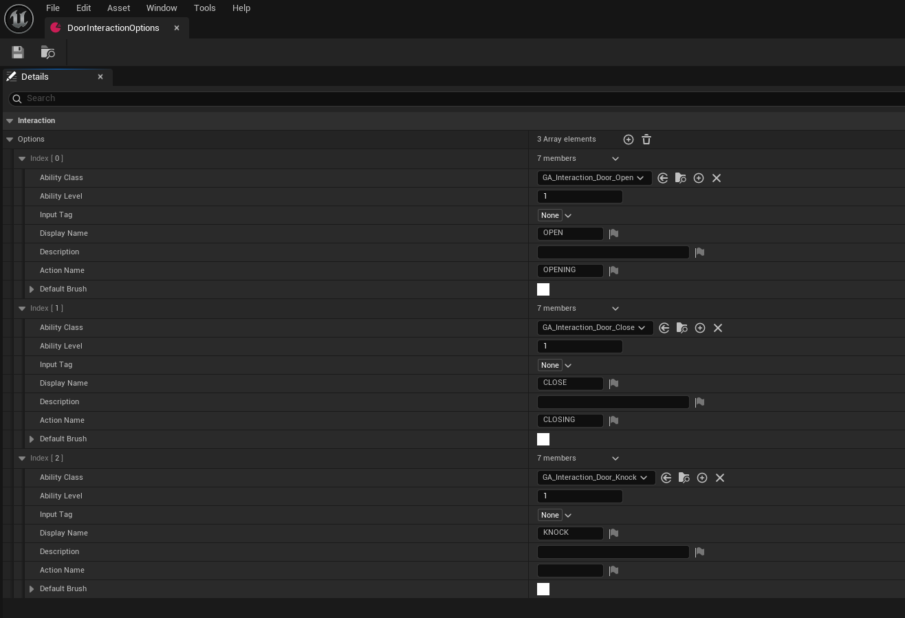
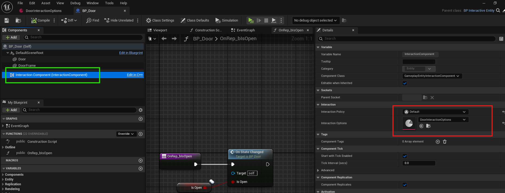

# Creating New Interaction Options

This guide provides step-by-step instructions on how to create and configure **Interaction Options** data assets for the **Gameplay Interaction Plugin**. Interaction options define the actions players can perform when interacting with an entity that has this data asset attached.

---

### 1. **Create an Interaction Options Data Asset**

- Navigate to `Miscellaneous > Data Asset` in the Content Browser.
- Select `GameplayInteractionOptions` as the parent class.
- Name the asset appropriately (e.g., `DoorInteractionOptions`).

---

### 2. **Configure the Interaction Options**

Once you've created the data asset, you can begin configuring the interaction options. 
This involves defining the specific abilities that players can perform when interacting with the associated entity.

- Open the newly created data asset (e.g., `DoorInteractionOptions`).
- In the **Details Panel**, you'll see various properties, such as `Ability Class`, `Ability Level`, `Ability Input Tag`, `Display Name`, `Description`, `Action Name`, and `Default Brush`. These properties are described in the table below:

| **Property**            | **Description**                                                                 |
|-------------------------|---------------------------------------------------------------------------------|
| `Ability Class`         | Interaction ability blueprint class that defines the functionality of the ability. |
| `Ability Level`         | The level of the interaction ability, which can define the strength or effect of the ability. |
| `Ability Input Tag`     | The input tag used to activate the ability (currently not used).                |
| `Display Name`          | The name of the interaction option, displayed in the UI.                        |
| `Description`           | A short description of the interaction option for the player.                   |
| `Action Name`           | The timed interaction action name displayed above the time progress bar during interaction. |
| `Default Brush`         | The icon or image that represents the interaction option in the user interface. |

- Adjust these properties to match the interaction design for your entity. You can create different interaction abilities based on instant or timed interaction abilities.

---

### 3. **Assign the Interaction Options to Entities**

Now that your interaction options data asset is created and configured, you need to assign it to the relevant entities in your game. This is typically done in the actor or the interactive entity.

- Open the actor in the **Details Panel**.
- Click on the **Interaction Component** for the entity or actor and locate the **Interaction Options** property.
- Select your newly created data asset from the drop-down list to assign it.

---

### 4. **Test and Iterate**

Once the interaction options have been assigned, it’s time to test the functionality. 
Place the entity or actor in the game world and ensure that the interactions work as expected and that they trigger the correct abilities in your game.

---

By following this guide, you should now be able to create and configure interaction options data assets to customize how players interact with entities in your game. Experiment with different actions and conditions to build rich and dynamic player experiences.
