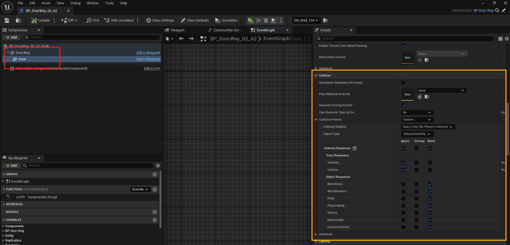

# Creating New Interactive Entities

This guide walks you through the process of creating and configuring **Interactive Entities** for the **Gameplay Interaction Plugin**. 
Create new actors for players to interact with easily.

---

There are two ways to create interactive entities in your game:

## 1. **Inherit from `AInteractiveEntity`**

You can create a new interactive entity by inheriting from the `AInteractiveEntity` actor that comes with the plugin.

1. Create a new Blueprint or C++ class based on `AInteractiveEntity`.
2. In your actor Blueprint, add meshes or visuals to design your entity.
3. To enable outline drawing, override the following methods:
   - `SupportsDrawingOutline`
   - `DrawOutline`
   - `RemoveOutline`

Call `SetRenderCustomDepth(true/false)` on the meshes you want to highlight or remove highlight with outlines.

---

## 2. **Use Your Own Actor + Interfaces (C++ Only)**

If you'd like to convert your own actor into an interactive entity, implement the following interfaces in C++:

- `IOutlineDrawingEntityInterface`
- `IGameplayInteractiveEntityInterface`

Here's a full example:

```cpp
#include "GameplayTagContainer.h"
#include "IOutlineDrawingEntityInterface.h"
#include "Core/GameplayInteractionLibrary.h"
#include "Core/IGameplayInteractiveEntityInterface.h"
#include "Core/GameplayEntityInteractionComponent.h"

class UAbilitySystemComponent;
class UGameplayInteractionOptions;

UCLASS(Blueprintable, BlueprintType)
class GAMEPLAYINTERACTION_API AMyOwnActor : public AActor, public IOutlineDrawingEntityInterface, public IGameplayInteractiveEntityInterface
{
    GENERATED_BODY()

public:

    AMyOwnActor(const FObjectInitializer& ObjectInitializer);

    virtual void DrawOutline_Implementation() const override;
    virtual void RemoveOutline_Implementation() const override;
    virtual bool SupportsDrawingOutline_Implementation() const override;

    UFUNCTION(BlueprintPure, Category = "Entity")
    virtual UGameplayInteractionOptions* GetInteractionOptions() override;

    UFUNCTION(BlueprintPure, Category = "Entity")
    virtual UGameplayEntityInteractionComponent* GetInteractionComponent() override;

    UFUNCTION(BlueprintPure, Category = "Entity")
    virtual bool CanInteract(UAbilitySystemComponent* Player, FGameplayTagContainer& FailureTags) override;

    UFUNCTION(BlueprintPure, Category = "Entity")
    FGameplayInteractionOption GetInteractionOptionByIndex(int32 OptionIndex);

protected:

    UPROPERTY(EditDefaultsOnly, BlueprintReadOnly, Category = "Entity")
    TObjectPtr<UGameplayEntityInteractionComponent> InteractionComponent;
};
```


```cpp
AMyOwnActor::AMyOwnActor(const FObjectInitializer& ObjectInitializer) : Super(ObjectInitializer)
{
    bReplicates = true;
    SetReplicatingMovement(true);
    bReplicateUsingRegisteredSubObjectList = true;

    InteractionComponent = CreateDefaultSubobject<UGameplayEntityInteractionComponent>(TEXT("InteractionComponent"));
    InteractionComponent->SetIsReplicated(true);
}

void AMyOwnActor::DrawOutline_Implementation() const
{
    // Define which meshes should display outlines.
}

void AMyOwnActor::RemoveOutline_Implementation() const
{
    // Remove outlines from the defined meshes.
}

bool AMyOwnActor::SupportsDrawingOutline_Implementation() const
{
    return true;
}

UGameplayInteractionOptions* AMyOwnActor::GetInteractionOptions()
{
    return InteractionComponent->GetInteractionOptions();
}

UGameplayEntityInteractionComponent* AMyOwnActor::GetInteractionComponent()
{
    return InteractionComponent;
}

bool AMyOwnActor::CanInteract(UAbilitySystemComponent* Player, FGameplayTagContainer& FailureTags)
{
    return InteractionComponent->CanInteract(Player, FailureTags);
}

FGameplayInteractionOption AMyOwnActor::GetInteractionOptionByIndex(const int32 OptionIndex)
{
    if (!InteractionComponent->GetInteractionOptions())
    {
        return FGameplayInteractionOption::EmptyOption;
    }

    const TArray<FGameplayInteractionOption>& Options = InteractionComponent->GetInteractionOptions()->GetOptions();

    if (Options.IsValidIndex(OptionIndex))
    {
        return Options[OptionIndex];
    }

    return FGameplayInteractionOption::EmptyOption;
}
```

---

## 3. Configure Your Interactive Entity

After adding meshes and visuals to your interactive actor:

- **Select the `InteractionComponent`** in the Details panel.
- Choose an **Interaction Policy** that matches the desired behavior (e.g., Default, Specific Number Of Players, Specific Players).
- Under the component settings, **assign the interaction options** that will be granted to the player when they approach or interact.

The table below outlines the available **Interaction Policies** you can assign to an interactive entity.

| **Policy Name**             | **Description**                                                                                                                                               | **Notes**                                                                                                                                                            |
|----------------------------|---------------------------------------------------------------------------------------------------------------------------------------------------------------|-----------------------------------------------------------------------------------------------------------------------------------------------------------------------|
| `Default`                  | Unlimited interactions; any player can interact at any time without restrictions.                                                                             | No special handling required.                                                                                                                                        |
| `SpecificNumberOfPlayers` | Allows a limited number of players to interact simultaneously, as specified in the component settings.                                                        | Players beyond the limit must wait until others finish interacting.                                                                                                   |
| `SpecificPlayers`         | Only specific players can interact based on their `UniqueNetId`.                                                                                              | Use `RegisterPlayerForInteraction` and `UnregisterPlayerFromInteraction` **on the server** to control access. If removing an active interactor, call `FinishInteraction`. |

> ⚠️ **Important**:  
> - `RegisterPlayerForInteraction` and `UnregisterPlayerFromInteraction` must be called **on the authority/server only**.  
> - If you unregister a player currently interacting, **call `FinishInteraction`** to cleanly end their interaction state.

:::info
You can also create custom interaction policies by inheriting from the `UGameplayInteractionPolicy` C++ class.
This allows you to implement custom rules and behavior for interaction access, tailored to your game’s specific needs.
:::

> To create a new interaction options asset, refer to [this page](creating-new-interaction-options).

---

## 4. Configure Mesh Collision Settings for Interaction

Make sure the correct meshes are setup to handle player interaction:

- Select the **mesh(es)** you want the player to interact with (e.g., a door mesh).
- Set their **collision preset** to:
  - `Interaction` (recommended), or
  - `Custom` and configure manually:
    - Set **Object Type** to `InteractiveEntity`.
    - Ensure the **InteractiveEntity** collision response is set to **Block**.
    - Disable collision for other unused channels, if needed.

📌 This ensures the interaction trace system can detect the mesh when the player looks at it.

> Refer to the image below for an example collision setup.



---

With either approach, you'll have full control over how your interactive entities look, behave, and react to player interaction.
