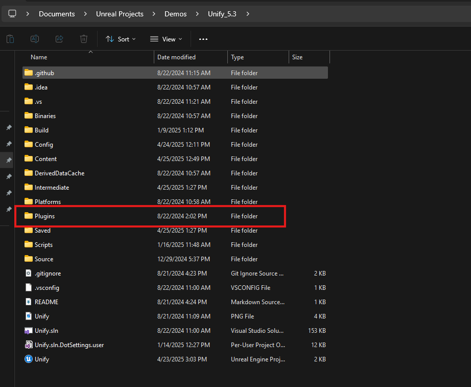

# Setup

### Downloading and Locating the Gameplay Interaction Plugin

---

## Step 1: Download the Plugin

Download the **Gameplay Interaction** plugin from the **Epic Games Launcher** for the version of Unreal Engine you are using (5.1 and above).

---

## Step 2: Locate the Plugin

After downloading, you can find the plugin in the following directory:  
`{EngineDirectory}/Plugins/Marketplace/GameplayInteraction`


---

## Step 3: Copy the Plugin to Your Project

- Close your Unreal project and any open IDEs.
- Copy the **GameplayInteraction** plugin folder from the directory above and paste it inside your project's **Plugins** folder.

:::note  
If the **Plugins** folder doesn’t exist in your project directory, create it manually.
:::




- Right-click your `.uproject` file and select `Generate Visual Studio project files`.

---

## Step 4: Enable the Plugin in the Editor

- Open your project in **Unreal Editor**.
- Navigate to **Edit > Plugins > Gameplay category**.
- Enable the **Gameplay Interaction** plugin.


:::note
Ensure the following dependencies are also enabled:
- **Gameplay Abilities**
- **Enhanced Input**
- **Common UI**
:::

---

## Step 5: Open the Project in Your IDE

:::note
If you’re working on a **Blueprint-only** project, create an empty C++ class to convert it into a C++ project.
:::

- Open your project's `.Build.cs` file (`Source/YourProject/YourProject.Build.cs`)
- Add the following modules to your dependencies:

```csharp
PublicDependencyModuleNames.AddRange(new string[]
{
    "Core",
    "CoreUObject",
    "Engine",
    "InputCore",

    "GameplayAbilities",
    "GameplayTags",
    "EnhancedInput",
    "CommonUI",
    "GameplayInteraction"
});

PrivateDependencyModuleNames.AddRange(new string[]
{
    "UMG",
    "Slate",
    "SlateCore"
});
```

- Save the file.
- Regenerate Visual Studio project files again.
- Reopen the project in your IDE.

---

## Step 6: Integrating with Your Project

This step assumes you have a `Character`, `PlayerController`, and `PlayerState` class already set up.

**PlayerState Setup**

Create or modify your `PlayerState` class to implement `IAbilitySystemInterface` and hold an `AbilitySystemComponent`.

```cpp
UCLASS()
class MYPROJECT_API AMyPlayerState : public APlayerState, public IAbilitySystemInterface
{
    GENERATED_BODY()

public:
    AMyPlayerState();

    virtual UAbilitySystemComponent* GetAbilitySystemComponent() const override;

protected:
    UPROPERTY(VisibleAnywhere, BlueprintReadOnly)
    TObjectPtr<UAbilitySystemComponent> AbilitySystemComponent;
};
```

**PlayerController Setup**

Now, integrate the `UGameplayInteractionComponent`, and optionally other GAS-related systems.

:::info
The `UGameplayInteractionComponent` is now a controller component which should be only added to controllers such as APlayerController class.
:::

```cpp
UCLASS()
class MYPROJECT_API AMyPlayerController : public APlayerController, public IAbilitySystemInterface, public IGameplayInteractionInterface
{
    GENERATED_BODY()

public:

    AMyPlayerController(const FObjectInitializer& ObjectInitializer);

    virtual UAbilitySystemComponent* GetAbilitySystemComponent() const override;

    UFUNCTION(BlueprintPure, Category = "Interaction")
    virtual UGameplayInteractionComponent* GetInteractionComponent() override;

    virtual void OnPossess(APawn* InPawn) override;
    virtual void OnRep_PlayerState() override;

protected:

    UPROPERTY(VisibleAnywhere, BlueprintReadOnly, Category = "Interaction")
    TObjectPtr<UGameplayInteractionComponent> InteractionComponent;

};
```

```cpp
AMyPlayerController::AMyPlayerController(const FObjectInitializer& ObjectInitializer)
    : Super(ObjectInitializer)
{
    InteractionComponent = CreateDefaultSubobject<UGameplayInteractionComponent>(TEXT("InteractionComponent"));
    InteractionComponent->SetIsReplicated(true);
}

UAbilitySystemComponent* AMyPlayerController::GetAbilitySystemComponent() const
{
    if (const AMyPlayerState* PS = GetPlayerState<AMyPlayerState>())
    {
        return PS->GetAbilitySystemComponent();
    }

    return nullptr;
}

UGameplayInteractionComponent* AMyPlayerController::GetInteractionComponent() const
{
    return InteractionComponent;
}

void AMyPlayerController::OnPossess(APawn* InPawn)
{
    Super::OnPossess(InPawn);

    if (AMyPlayerState* PS = GetPlayerState<AMyPlayerState>())
    {
        InteractionComponent->RegisterAbilitySystemComponent(PS->GetAbilitySystemComponent());
    }
}

void AMyPlayerController::OnRep_PlayerState()
{
    Super::OnRep_PlayerState();

    if (AMyPlayerState* PS = GetPlayerState<AMyPlayerState>())
    {
        InteractionComponent->RegisterWithAbilitySystem(PS->GetAbilitySystemComponent());
    }
}
```

---

## Step 7: Interactable Actor Example

To make an actor interactable, implement the appropriate interface and component setup.

:::info
You can either make your actor inherit from `AInteractiveEntity` or create/use your own custom actor class that should implement the following interfaces:

- `IGameplayInteractiveEntityInterface`
- `IOutlineDrawingEntityInterface`

you can check the `AInteractiveEntity` class to see how to implement them in your own actor class.
:::

```cpp
UCLASS(Blueprintable, BlueprintType)
class YOURPROJECT_API AMyInteractableActor : public AActor, public IOutlineDrawingEntityInterface, public IGameplayInteractiveEntityInterface
{
    GENERATED_BODY()

    // @see AInteractiveEntity actor class in the plugin source code for example implementation
};
```

---

## Step 8: Setting up collision settings in engine

After compiling the project and launching the unreal editor from IDE or manually.

- When you open the unreal engine editor, go to `Project Settings > Collision` and make sure you add the collision presets in the pictures below.


- Now for the outline feature to work when looking at interactive entities you will need to add a `PostProcessVolume` to your level, make it infinite extent (unbound)
and add a post process material then select `MI_Outline_White` material from the `GameplayInteraction` plugin

:::note
If you dont see the plugin content or you cannot select plugin related content, make sure to click on the settings button in your `ContentBrowser` the settings button
is top-right side of the screen, then make sure `Show Plugin Content` is checked or enabled to be able to see plugin content in your project.
:::


---

## Step 9: Setting up a custom ability system component and binding inputs for gameplay abilities

---

## Step 10: Setting up interaction and interactive entities for testing

- First you will need to add `W_Interaction_Indicator` widget to your main HUD widget which you can find the in plugins content `UI` folder (the widget is usually placed in the center with an offset).

> Make sure this `W_Interaction_Indicator` widget is initially invisible. It should become visible when there is an interactive entity in the player view.

:::info
You will need to give `GA_Interact` and `GA_ShowInteractionOptions` abilities to your ability system on begin play or when the game start (depends on your project) to be able to scan or perform interactions, check the demo project for info on how to set it up properly with GAS.
:::

> You can simply call `GiveAbilityAndActivateOnce` function for `GA_Interact` in your character class or player state depends on where you have the ability system.
> You should also call `GiveAbility` function for `GA_ShowInteractionOptions` in your character class or player state depends on where you have the ability system.
