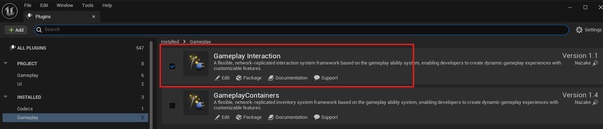

# Setup

### Downloading and Locating the Gameplay Interaction Plugin

---

## Step 1: Download the Plugin

Download the **Gameplay Interaction** plugin from the **Epic Games Launcher** for the version of Unreal Engine you are using (5.1 and above).

---

## Step 2: Locate the Plugin

After downloading, you can find the plugin in the following directory:  
`{EngineDirectory}/Plugins/Marketplace/GameplayInteraction`


---

## Step 3: Copy the Plugin to Your Project

- Close your Unreal project and any open IDEs.
- Copy the **GameplayInteraction** plugin folder from the directory above and paste it inside your project's **Plugins** folder.

:::note  
If the **Plugins** folder doesn’t exist in your project directory, create it manually.
:::


- Right-click your `.uproject` file and select `Generate Visual Studio project files`.

---

## Step 4: Enable the Plugin in the Editor

- Open your project in **Unreal Editor**.
- Navigate to **Edit > Plugins > Gameplay category**.
- Enable the **Gameplay Interaction** plugin.



:::note
Ensure the following dependencies are also enabled:
- **Gameplay Abilities**
- **Enhanced Input**
- **Common UI**
:::

---

## Step 5: Open the Project in Your IDE

:::note
If you’re working on a **Blueprint-only** project, create an empty C++ class to convert it into a C++ project.
:::

- Open your project's `.Build.cs` file (`Source/YourProject/YourProject.Build.cs`)
- Add the following modules to your dependencies:

```csharp
PublicDependencyModuleNames.AddRange(new string[]
{
    "Core",
    "CoreUObject",
    "Engine",
    "InputCore",

    "GameplayAbilities",
    "GameplayTags",
    "EnhancedInput",
    "CommonUI",

    "GameplayInteraction"
});

PrivateDependencyModuleNames.AddRange(new string[]
{
    "UMG",
    "Slate",
    "SlateCore"
});
```

- Save the file.
- Regenerate Visual Studio project files again.
- Reopen the project in your IDE.

---

## Step 6: Integrating with Your Project

This step assumes you have a `Character`, `PlayerController`, and `PlayerState` class already set up.

**PlayerState Setup**

Create or modify your `PlayerState` class to implement `IAbilitySystemInterface` and hold an `AbilitySystemComponent`.

```cpp
UCLASS()
class MYPROJECT_API AMyPlayerState : public APlayerState, public IAbilitySystemInterface
{
    GENERATED_BODY()

public:
    AMyPlayerState();

    virtual UAbilitySystemComponent* GetAbilitySystemComponent() const override;

protected:
    UPROPERTY(VisibleAnywhere, BlueprintReadOnly)
    TObjectPtr<UAbilitySystemComponent> AbilitySystemComponent;
};
```

**PlayerController Setup**

Now, integrate the `UGameplayInteractionComponent`, and optionally other GAS-related systems.

:::info
The `UGameplayInteractionComponent` is now a controller component which should be only added to controllers such as APlayerController class.
:::

```cpp
UCLASS()
class MYPROJECT_API AMyPlayerController : public APlayerController, public IAbilitySystemInterface, public IGameplayInteractionInterface
{
    GENERATED_BODY()

public:

    AMyPlayerController(const FObjectInitializer& ObjectInitializer);

    virtual UAbilitySystemComponent* GetAbilitySystemComponent() const override;

    UFUNCTION(BlueprintPure, Category = "Interaction")
    virtual UGameplayInteractionComponent* GetInteractionComponent() override;

    virtual void OnPossess(APawn* InPawn) override;
    virtual void OnRep_PlayerState() override;

protected:

    UPROPERTY(VisibleAnywhere, BlueprintReadOnly, Category = "Interaction")
    TObjectPtr<UGameplayInteractionComponent> InteractionComponent;

};
```

```cpp
AMyPlayerController::AMyPlayerController(const FObjectInitializer& ObjectInitializer)
    : Super(ObjectInitializer)
{
    InteractionComponent = CreateDefaultSubobject<UGameplayInteractionComponent>(TEXT("InteractionComponent"));
    InteractionComponent->SetIsReplicated(true);
}

UAbilitySystemComponent* AMyPlayerController::GetAbilitySystemComponent() const
{
    if (const AMyPlayerState* PS = GetPlayerState<AMyPlayerState>())
    {
        return PS->GetAbilitySystemComponent();
    }

    return nullptr;
}

UGameplayInteractionComponent* AMyPlayerController::GetInteractionComponent() const
{
    return InteractionComponent;
}

void AMyPlayerController::OnPossess(APawn* InPawn)
{
    Super::OnPossess(InPawn);

    if (AMyPlayerState* PS = GetPlayerState<AMyPlayerState>())
    {
        InteractionComponent->RegisterAbilitySystemComponent(PS->GetAbilitySystemComponent());
    }
}

void AMyPlayerController::OnRep_PlayerState()
{
    Super::OnRep_PlayerState();

    if (AMyPlayerState* PS = GetPlayerState<AMyPlayerState>())
    {
        InteractionComponent->RegisterWithAbilitySystem(PS->GetAbilitySystemComponent());
    }
}
```

---

## Step 7: Interactable Actor Example

To make an actor interactable, implement the appropriate interface and component setup.

:::info
You can either make your actor inherit from `AInteractiveEntity` or create/use your own custom actor class that should implement the following interfaces:

- `IGameplayInteractiveEntityInterface`
- `IOutlineDrawingEntityInterface`

you can check the `AInteractiveEntity` class to see how to implement them in your own actor class.
:::

```cpp
UCLASS(Blueprintable, BlueprintType)
class YOURPROJECT_API AMyInteractableActor : public AActor, public IOutlineDrawingEntityInterface, public IGameplayInteractiveEntityInterface
{
    GENERATED_BODY()

    // @see AInteractiveEntity actor class in the plugin source code for example implementation
};
```

---

## Step 8: Setting up collision settings in engine

After compiling the project and launching the unreal editor from IDE or manually.

- When you open the unreal engine editor, go to `Project Settings > Collision` and make sure you add the collision presets in the pictures below.


- Now for the outline feature to work when looking at interactive entities you will need to add a `PostProcessVolume` to your level, make it infinite extent (unbound)
and add a post process material then select `MI_Outline_White` material from the `GameplayInteraction` plugin

:::note
If you dont see the plugin content or you cannot select plugin related content, make sure to click on the settings button in your `ContentBrowser` the settings button
is top-right side of the screen, then make sure `Show Plugin Content` is checked or enabled to be able to see plugin content in your project.
:::


---

## Step 9: Setting up a custom ability system component and binding inputs for gameplay abilities

:::info
To do this step, you need to open the project source code in your IDE while the editor is closed.  
If your project is currently Blueprint-only, you must create an empty C++ class from the editor first to convert your project into a C++ project.  
After that, you can open your IDE and proceed with this step.
:::

To enable your abilities and the ability system to handle input from gameplay tags (also known as input tags) and support wait input tasks, you need to implement several key functions within your custom Ability System Component.

These functions allow your component to:

- Process input events based on gameplay tags.
- Track pressed, held, and released input states.
- Activate abilities according to their input activation policies.
- Support ability input lifecycle management (press, hold, release).
- Integrate with gameplay ability tasks that wait for input events.

> YourAbilitySystem.h

```cpp
#pragma once

#include "CoreMinimal.h"
#include "AbilitySystemComponent.h"
#include "UnifyAbilitySystemComponent.generated.h"

UCLASS()
class UNIFY_API UUnifyAbilitySystemComponent : public UAbilitySystemComponent
{
	GENERATED_BODY()

public:

	virtual void TickComponent(float DeltaTime, ELevelTick TickType, FActorComponentTickFunction* ThisTickFunction) override;
	virtual void InitAbilityActorInfo(AActor* InOwnerActor, AActor* InAvatarActor) override;

	void AbilityInputTagPressed(const FGameplayTag& InputTag);
	void AbilityInputTagReleased(const FGameplayTag& InputTag);

	void ProcessAbilityInput(float DeltaTime, bool bGamePaused);
	void ClearAbilityInput();

	void GetAbilityTargetData(const FGameplayAbilitySpecHandle AbilityHandle, FGameplayAbilityActivationInfo ActivationInfo, FGameplayAbilityTargetDataHandle& OutTargetDataHandle) const;

	virtual void AbilitySpecInputPressed(FGameplayAbilitySpec& Spec) override;
	virtual void AbilitySpecInputReleased(FGameplayAbilitySpec& Spec) override;

protected:

	void TryActivateAbilitiesOnSpawn();

private:

	TArray<FGameplayAbilitySpecHandle> InputPressedSpecHandles;
	TArray<FGameplayAbilitySpecHandle> InputReleasedSpecHandles;
	TArray<FGameplayAbilitySpecHandle> InputHeldSpecHandles;
};
```

> YourAbilitySystem.cpp

```cpp
#include "AbilitySystem/UnifyAbilitySystemComponent.h"
#include "AbilitySystem/Abilities/UnifyGameplayAbility.h"
#include "Animation/UnifyAnimationInstance.h"
#include "UnifyGameplayTags.h"

void UUnifyAbilitySystemComponent::TickComponent(float DeltaTime, ELevelTick TickType, FActorComponentTickFunction* ThisTickFunction)
{
	Super::TickComponent(DeltaTime, TickType, ThisTickFunction);
}

void UUnifyAbilitySystemComponent::InitAbilityActorInfo(AActor* InOwnerActor, AActor* InAvatarActor)
{
	FGameplayAbilityActorInfo* ActorInfo = AbilityActorInfo.Get();

	check(ActorInfo);
	check(InOwnerActor);

	const bool bHasNewPawnAvatar = Cast<APawn>(InAvatarActor) && (InAvatarActor != ActorInfo->AvatarActor);
	Super::InitAbilityActorInfo(InOwnerActor, InAvatarActor);

	if (bHasNewPawnAvatar)
	{
		for (const FGameplayAbilitySpec& AbilitySpec : ActivatableAbilities.Items)
		{
			UUnifyGameplayAbility* AbilityCDO = CastChecked<UUnifyGameplayAbility>(AbilitySpec.Ability);

			if (AbilityCDO->GetInstancingPolicy() != EGameplayAbilityInstancingPolicy::NonInstanced)
			{
				TArray<UGameplayAbility*> Instances = AbilitySpec.GetAbilityInstances();
				for (UGameplayAbility* Instance : Instances)
				{
					if (UUnifyGameplayAbility* AbilityInstance = Cast<UUnifyGameplayAbility>(Instance))
					{
						AbilityInstance->OnPawnAvatarSet();
					}
				}
			}
			else
			{
				AbilityCDO->OnPawnAvatarSet();
			}
		}

		if (UUnifyAnimationInstance* AnimInstance = Cast<UUnifyAnimationInstance>(ActorInfo->GetAnimInstance()))
		{
			AnimInstance->RegisterWithAbilitySystem(this);
		}

		TryActivateAbilitiesOnSpawn();
	}
}

void UUnifyAbilitySystemComponent::TryActivateAbilitiesOnSpawn()
{
	ABILITYLIST_SCOPE_LOCK();

	for (const FGameplayAbilitySpec& AbilitySpec : ActivatableAbilities.Items)
	{
		const UUnifyGameplayAbility* AbilityCDO = CastChecked<UUnifyGameplayAbility>(AbilitySpec.Ability);
		AbilityCDO->TryActivateAbilityOnSpawn(AbilityActorInfo.Get(), AbilitySpec);
	}
}

void UUnifyAbilitySystemComponent::AbilityInputTagPressed(const FGameplayTag& InputTag)
{
	if (InputTag.IsValid())
	{
		for (const FGameplayAbilitySpec& AbilitySpec : ActivatableAbilities.Items)
		{
			if (AbilitySpec.Ability && AbilitySpec.DynamicAbilityTags.HasTagExact(InputTag))
			{
				InputPressedSpecHandles.AddUnique(AbilitySpec.Handle);
				InputHeldSpecHandles.AddUnique(AbilitySpec.Handle);
			}
		}
	}
}

void UUnifyAbilitySystemComponent::AbilityInputTagReleased(const FGameplayTag& InputTag)
{
	if (InputTag.IsValid())
	{
		for (const FGameplayAbilitySpec& AbilitySpec : ActivatableAbilities.Items)
		{
			if (AbilitySpec.Ability && AbilitySpec.DynamicAbilityTags.HasTagExact(InputTag))
			{
				InputReleasedSpecHandles.AddUnique(AbilitySpec.Handle);
				InputHeldSpecHandles.Remove(AbilitySpec.Handle);
			}
		}
	}
}

void UUnifyAbilitySystemComponent::ProcessAbilityInput(float DeltaTime, bool bGamePaused)
{
	if (HasMatchingGameplayTag(FUnifyGameplayTags::Get().Ability_Input_Blocked))
	{
		ClearAbilityInput();
		return;
	}

	static TArray<FGameplayAbilitySpecHandle> AbilitiesToActivate;
	AbilitiesToActivate.Reset();

	for (const FGameplayAbilitySpecHandle& SpecHandle : InputHeldSpecHandles)
	{
		if (const FGameplayAbilitySpec* Spec = FindAbilitySpecFromHandle(SpecHandle))
		{
			const UUnifyGameplayAbility* Ability = CastChecked<UUnifyGameplayAbility>(Spec->Ability);
			if (!Spec->IsActive() && Ability->GetActivationPolicy() == EGameplayAbilityActivationPolicy::OnInputHeld)
			{
				AbilitiesToActivate.AddUnique(Spec->Handle);
			}
		}
	}

	for (const FGameplayAbilitySpecHandle& SpecHandle : InputPressedSpecHandles)
	{
		if (FGameplayAbilitySpec* Spec = FindAbilitySpecFromHandle(SpecHandle))
		{
			Spec->InputPressed = true;

			if (Spec->IsActive())
			{
				AbilitySpecInputPressed(*Spec);
			}
			else
			{
				const UUnifyGameplayAbility* Ability = CastChecked<UUnifyGameplayAbility>(Spec->Ability);
				if (Ability->GetActivationPolicy() == EGameplayAbilityActivationPolicy::OnInputPressed)
				{
					AbilitiesToActivate.AddUnique(Spec->Handle);
				}
			}
		}
	}

	for (const FGameplayAbilitySpecHandle& Handle : AbilitiesToActivate)
	{
		TryActivateAbility(Handle);
	}

	for (const FGameplayAbilitySpecHandle& SpecHandle : InputReleasedSpecHandles)
	{
		if (FGameplayAbilitySpec* Spec = FindAbilitySpecFromHandle(SpecHandle))
		{
			Spec->InputPressed = false;

			if (Spec->IsActive())
			{
				AbilitySpecInputReleased(*Spec);
			}
		}
	}

	InputPressedSpecHandles.Reset();
	InputReleasedSpecHandles.Reset();
}

void UUnifyAbilitySystemComponent::ClearAbilityInput()
{
	InputPressedSpecHandles.Reset();
	InputReleasedSpecHandles.Reset();
	InputHeldSpecHandles.Reset();
}

void UUnifyAbilitySystemComponent::GetAbilityTargetData(const FGameplayAbilitySpecHandle AbilityHandle, FGameplayAbilityActivationInfo ActivationInfo, FGameplayAbilityTargetDataHandle& OutTargetDataHandle) const
{
	// Not yet implemented
}

void UUnifyAbilitySystemComponent::AbilitySpecInputPressed(FGameplayAbilitySpec& Spec)
{
	if (UUnifyGameplayAbility* Ability = Cast<UUnifyGameplayAbility>(Spec.Ability))
	{
		Ability->InputPressed(Spec);
	}
}

void UUnifyAbilitySystemComponent::AbilitySpecInputReleased(FGameplayAbilitySpec& Spec)
{
	if (UUnifyGameplayAbility* Ability = Cast<UUnifyGameplayAbility>(Spec.Ability))
	{
		Ability->InputReleased(Spec);
	}
}

```

> YourAbility.h

```cpp
#include "CoreMinimal.h"
#include <Abilities/GameplayAbility.h>
#include "UnifyGameplayAbility.generated.h"

class UUnifyAbilitySystemComponent;
class AUnifyPlayerController;
class AUnifyCharacter;

UENUM(BlueprintType)
enum class EGameplayAbilityActivationPolicy : uint8
{
	OnInputPressed,
	OnInputHeld,
	OnSpawn,
};

UCLASS()
class UNIFY_API UUnifyGameplayAbility : public UGameplayAbility
{
	GENERATED_BODY()

public:

	UUnifyGameplayAbility();

	UFUNCTION(BlueprintPure, Category = "Unify|Ability")
	EGameplayAbilityActivationPolicy GetActivationPolicy() const;

	UFUNCTION(BlueprintPure, Category = "Unify|Ability")
	EGameplayAbilityActivationGroup GetActivationGroup() const;

	UFUNCTION(BlueprintCallable, Category = "Unify|Ability")
	UUnifyAbilitySystemComponent* GetUnifyAbilitySystemComponentFromActorInfo() const;

	UFUNCTION(BlueprintCallable, Category = "Unify|Ability")
	AUnifyPlayerController* GetUnifyPlayerControllerFromActorInfo() const;

	UFUNCTION(BlueprintCallable, Category = "Unify|Ability")
	AController* GetControllerFromActorInfo() const;

	UFUNCTION(BlueprintCallable, Category = "Unify|Ability")
	AUnifyCharacter* GetUnifyCharacterFromActorInfo() const;

	virtual void OnGiveAbility(const FGameplayAbilityActorInfo* ActorInfo, const FGameplayAbilitySpec& Spec) override;
	virtual void OnRemoveAbility(const FGameplayAbilityActorInfo* ActorInfo, const FGameplayAbilitySpec& Spec) override;
	
	void TryActivateAbilityOnSpawn(const FGameplayAbilityActorInfo* ActorInfo, const FGameplayAbilitySpec& Spec) const;

	virtual void OnAvatarSet(const FGameplayAbilityActorInfo* ActorInfo, const FGameplayAbilitySpec& Spec) override;
	virtual void OnPawnAvatarSet();

	UFUNCTION(BlueprintImplementableEvent, DisplayName = "On Ability Granted", Category = "Ability")
	void BP_OnAbilityGranted();

	UFUNCTION(BlueprintImplementableEvent, DisplayName = "On Ability Revoked", Category = "Ability")
	void BP_OnAbilityRevoked();

	UFUNCTION(BlueprintImplementableEvent, DisplayName = "On Avatar Set", Category = "Ability")
	void BP_OnAvatarSet();

protected:

	UPROPERTY(EditDefaultsOnly, BlueprintReadOnly, Category = "Ability|Activation")
	EGameplayAbilityActivationPolicy ActivationPolicy;
	
};
```

> YourAbility.cpp

```cpp
#include "AbilitySystem/Abilities/UnifyGameplayAbility.h"
#include "AbilitySystem/UnifyAbilitySystemComponent.h"
#include "Player/UnifyPlayerController.h"
#include "Character/UnifyCharacter.h"

UUnifyGameplayAbility::UUnifyGameplayAbility()
{
	ReplicationPolicy = EGameplayAbilityReplicationPolicy::ReplicateNo;
	InstancingPolicy = EGameplayAbilityInstancingPolicy::InstancedPerActor;
	NetExecutionPolicy = EGameplayAbilityNetExecutionPolicy::LocalPredicted;
	NetSecurityPolicy = EGameplayAbilityNetSecurityPolicy::ClientOrServer;
	ActivationPolicy = EGameplayAbilityActivationPolicy::OnInputPressed;
}

EGameplayAbilityActivationPolicy UUnifyGameplayAbility::GetActivationPolicy() const
{
	return ActivationPolicy;
}

UUnifyAbilitySystemComponent* UUnifyGameplayAbility::GetUnifyAbilitySystemComponentFromActorInfo() const
{
	return (CurrentActorInfo ? Cast<UUnifyAbilitySystemComponent>(CurrentActorInfo->AbilitySystemComponent.Get()) : nullptr);
}

AUnifyPlayerController* UUnifyGameplayAbility::GetUnifyPlayerControllerFromActorInfo() const
{
	return (CurrentActorInfo ? Cast<AUnifyPlayerController>(CurrentActorInfo->PlayerController.Get()) : nullptr);
}

AController* UUnifyGameplayAbility::GetControllerFromActorInfo() const
{
	if (CurrentActorInfo)
	{
		if (AController* PC = CurrentActorInfo->PlayerController.Get())
		{
			return PC;
		}

		AActor* TestActor = CurrentActorInfo->OwnerActor.Get();
		
		while (TestActor)
		{
			if (AController* C = Cast<AController>(TestActor))
			{
				return C;
			}

			if (const APawn* Pawn = Cast<APawn>(TestActor))
			{
				return Pawn->GetController();
			}

			TestActor = TestActor->GetOwner();
		}
	}

	return nullptr;
}

AUnifyCharacter* UUnifyGameplayAbility::GetUnifyCharacterFromActorInfo() const
{
	return (CurrentActorInfo ? Cast<AUnifyCharacter>(CurrentActorInfo->AvatarActor.Get()) : nullptr);
}

void UUnifyGameplayAbility::OnGiveAbility(const FGameplayAbilityActorInfo* ActorInfo, const FGameplayAbilitySpec& Spec)
{
	Super::OnGiveAbility(ActorInfo, Spec);

	BP_OnAbilityGranted();
	TryActivateAbilityOnSpawn(ActorInfo, Spec);
}

void UUnifyGameplayAbility::OnRemoveAbility(const FGameplayAbilityActorInfo* ActorInfo, const FGameplayAbilitySpec& Spec)
{
	BP_OnAbilityRevoked();
	
	Super::OnRemoveAbility(ActorInfo, Spec);
}

void UUnifyGameplayAbility::TryActivateAbilityOnSpawn(const FGameplayAbilityActorInfo* ActorInfo, const FGameplayAbilitySpec& Spec) const
{
	const bool bIsPredicting = (Spec.ActivationInfo.ActivationMode == EGameplayAbilityActivationMode::Predicting);

	if (ActorInfo && !Spec.IsActive() && !bIsPredicting && (ActivationPolicy == EGameplayAbilityActivationPolicy::OnSpawn))
	{
		UAbilitySystemComponent* ASC = ActorInfo->AbilitySystemComponent.Get();
		const AActor* AvatarActor = ActorInfo->AvatarActor.Get();

		if (ASC && AvatarActor && !AvatarActor->GetTearOff() && (AvatarActor->GetLifeSpan() <= 0.0f))
		{
			const bool bIsLocalExecution = (NetExecutionPolicy == EGameplayAbilityNetExecutionPolicy::LocalPredicted) || (NetExecutionPolicy == EGameplayAbilityNetExecutionPolicy::LocalOnly);
			const bool bIsServerExecution = (NetExecutionPolicy == EGameplayAbilityNetExecutionPolicy::ServerOnly) || (NetExecutionPolicy == EGameplayAbilityNetExecutionPolicy::ServerInitiated);

			const bool bClientShouldActivate = ActorInfo->IsLocallyControlled() && bIsLocalExecution;
			const bool bServerShouldActivate = ActorInfo->IsNetAuthority() && bIsServerExecution;

			if (bClientShouldActivate || bServerShouldActivate)
			{
				ASC->TryActivateAbility(Spec.Handle);
			}
		}
	}
}

void UUnifyGameplayAbility::OnAvatarSet(const FGameplayAbilityActorInfo* ActorInfo, const FGameplayAbilitySpec& Spec)
{
	Super::OnAvatarSet(ActorInfo, Spec);
	
	BP_OnAvatarSet();
}

void UUnifyGameplayAbility::OnPawnAvatarSet()
{
	
}
```

> YourPlayerController.h

```cpp
UCLASS()
class UNIFY_API AUnifyPlayerController : public ACommonPlayerController, public IAbilitySystemInterface, public IGameplayInteractionInterface
{
	GENERATED_BODY()

public:

	AUnifyPlayerController();

    UFUNCTION(BlueprintCallable, Category = "Unify|PlayerController")
	UUnifyAbilitySystemComponent* GetUnifyAbilitySystemComponent() const;

	virtual void PreProcessInput(const float DeltaTime, const bool bGamePaused) override;
	virtual void PostProcessInput(const float DeltaTime, const bool bGamePaused) override;

};
```

> YourPlayerController.cpp

```cpp
AUnifyPlayerController::AUnifyPlayerController()
{

}

UAbilitySystemComponent* AUnifyPlayerController::GetAbilitySystemComponent() const
{
	if (const AUnifyPlayerState* MyPlayerState = GetPlayerState<AUnifyPlayerState>())
	{
		return MyPlayerState->GetAbilitySystemComponent();
	}

	return nullptr;
}

void AUnifyPlayerController::PreProcessInput(const float DeltaTime, const bool bGamePaused)
{
	Super::PreProcessInput(DeltaTime, bGamePaused);
}

void AUnifyPlayerController::PostProcessInput(const float DeltaTime, const bool bGamePaused)
{
	if (UUnifyAbilitySystemComponent* ASC = GetUnifyAbilitySystemComponent())
	{
		ASC->ProcessAbilityInput(DeltaTime, bGamePaused);
	}
	
	Super::PostProcessInput(DeltaTime, bGamePaused);
}
```

> YourInputConfig.h

```cpp
#include "CoreMinimal.h"
#include "Engine/DataAsset.h"
#include "GameplayTagContainer.h"
#include "EnhancedInputComponent.h"
#include "UnifyInputConfig.generated.h"

class UInputAction;
class UInputMappingContext;

USTRUCT(BlueprintType)
struct FInputMappingContextAndPriority
{
	GENERATED_BODY()

	FInputMappingContextAndPriority();

	UPROPERTY(EditAnywhere, Category="Input")
	TObjectPtr<UInputMappingContext> InputMapping;

	/** Higher priority input mappings will be prioritized over mappings with a lower priority. */
	UPROPERTY(EditAnywhere, Category="Input")
	int32 Priority;
	
};

USTRUCT(BlueprintType)
struct FUnifyInputAction
{
	GENERATED_BODY()

	FUnifyInputAction();

	bool IsValid() const;

	UPROPERTY(EditDefaultsOnly, BlueprintReadOnly, Category = "Input")
	TObjectPtr<UInputAction> InputAction;

	UPROPERTY(EditDefaultsOnly, BlueprintReadOnly, meta = (Categories = "Input"), Category = "Input")
	FGameplayTag InputTag;

	UPROPERTY(EditDefaultsOnly, BlueprintReadOnly, Category = "Input")
	TArray<ETriggerEvent> PressedTriggers;

	UPROPERTY(EditDefaultsOnly, BlueprintReadOnly, Category = "Input")
	TArray<ETriggerEvent> ReleasedTriggers;
	
};

UCLASS()
class UNIFY_API UUnifyInputConfig : public UDataAsset
{
	GENERATED_BODY()

public:

	UUnifyInputConfig(const FObjectInitializer& ObjectInitializer);

	UFUNCTION(BlueprintCallable, Category = "Unify|Input")
	FUnifyInputAction FindNativeActionForTag(const FGameplayTag& InputTag, bool bLogNotFound = true) const;

	UFUNCTION(BlueprintCallable, Category = "Unify|Input")
	const UInputAction* FindNativeInputActionForTag(const FGameplayTag& InputTag, bool bLogNotFound = true) const;

	UFUNCTION(BlueprintCallable, Category = "Unify|Input")
	FUnifyInputAction FindAbilityActionForTag(const FGameplayTag& InputTag, bool bLogNotFound = true) const;

	UFUNCTION(BlueprintCallable, Category = "Unify|Input")
	const UInputAction* FindAbilityInputActionForTag(const FGameplayTag& InputTag, bool bLogNotFound = true) const;

	UFUNCTION(BlueprintPure, Category = "Unify|Input")
	const TArray<FUnifyInputAction>& GetNativeInputActions() const;

	UFUNCTION(BlueprintPure, Category = "Unify|Input")
	const TArray<FUnifyInputAction>& GetAbilityInputActions() const;

	UFUNCTION(BlueprintPure, Category = "Unify|Input")
	const TArray<FInputMappingContextAndPriority>& GetInputMappingContexts() const;

protected:

	UPROPERTY(EditDefaultsOnly, BlueprintReadOnly, Meta = (TitleProperty = "InputAction"), Category = "Input")
	TArray<FUnifyInputAction> NativeInputActions;

	UPROPERTY(EditDefaultsOnly, BlueprintReadOnly, Meta = (TitleProperty = "InputAction"), Category = "Input")
	TArray<FUnifyInputAction> AbilityInputActions;

	UPROPERTY(EditDefaultsOnly, BlueprintReadOnly, Category="Input")
	TArray<FInputMappingContextAndPriority> InputMappings;
	
};

```

> YourInputConfig.cpp

```cpp
#include "Input/UnifyInputConfig.h"
#include "UnifyLogging.h"

FInputMappingContextAndPriority::FInputMappingContextAndPriority() : InputMapping(nullptr), Priority(0)
{
}

FUnifyInputAction::FUnifyInputAction()
{
	PressedTriggers.AddUnique(ETriggerEvent::Triggered);
	ReleasedTriggers.AddUnique(ETriggerEvent::Completed);
}

bool FUnifyInputAction::IsValid() const
{
	return InputAction != nullptr;
}

UUnifyInputConfig::UUnifyInputConfig(const FObjectInitializer& ObjectInitializer) : Super(ObjectInitializer)
{
}

FUnifyInputAction UUnifyInputConfig::FindNativeActionForTag(const FGameplayTag& InputTag, const bool bLogNotFound) const
{
	for (const FUnifyInputAction& Action : NativeInputActions)
	{
		if (Action.InputAction && (Action.InputTag == InputTag))
		{
			return Action;
		}
	}

	if (bLogNotFound)
	{
		UNIFY_LOG(Error, TEXT("Can't find NativeAction for InputTag {0} on InputConfig {1}"), *InputTag.ToString(), *THIS_OBJECT_NAME);
	}

	return FUnifyInputAction();
}

const UInputAction* UUnifyInputConfig::FindNativeInputActionForTag(const FGameplayTag& InputTag, const bool bLogNotFound) const
{
	for (const FUnifyInputAction& Action : NativeInputActions)
	{
		if (Action.InputAction && (Action.InputTag == InputTag))
		{
			return Action.InputAction;
		}
	}

	if (bLogNotFound)
	{
		UNIFY_LOG(Error, TEXT("Can't find NativeInputAction for InputTag [%s] on InputConfig [%s]."), *InputTag.ToString(), *THIS_OBJECT_NAME);
	}

	return nullptr;
}

FUnifyInputAction UUnifyInputConfig::FindAbilityActionForTag(const FGameplayTag& InputTag, bool bLogNotFound) const
{
	for (const FUnifyInputAction& Action : AbilityInputActions)
	{
		if (Action.InputAction && (Action.InputTag == InputTag))
		{
			return Action;
		}
	}

	if (bLogNotFound)
	{
		UNIFY_LOG(Error, TEXT("Can't find NativeAction for InputTag [%s] on InputConfig [%s]."), *InputTag.ToString(), *THIS_OBJECT_NAME);
	}

	return FUnifyInputAction();
}

const UInputAction* UUnifyInputConfig::FindAbilityInputActionForTag(const FGameplayTag& InputTag, const bool bLogNotFound) const
{
	for (const FUnifyInputAction& Action : AbilityInputActions)
	{
		if (Action.InputAction && (Action.InputTag == InputTag))
		{
			return Action.InputAction;
		}
	}

	if (bLogNotFound)
	{
		UNIFY_LOG(Error, TEXT("Can't find AbilityInputAction for InputTag [%s] on InputConfig [%s]."), *InputTag.ToString(), *THIS_OBJECT_NAME);
	}

	return nullptr;
}

const TArray<FUnifyInputAction>& UUnifyInputConfig::GetNativeInputActions() const
{
	return NativeInputActions;
}

const TArray<FUnifyInputAction>& UUnifyInputConfig::GetAbilityInputActions() const
{
	return AbilityInputActions;
}

const TArray<FInputMappingContextAndPriority>& UUnifyInputConfig::GetInputMappingContexts() const
{
	return InputMappings;
}
```

> YourAbilitySet.h

```cpp
#include "CoreMinimal.h"
#include "ActiveGameplayEffectHandle.h"
#include "GameplayAbilitySpecHandle.h"
#include "Engine/DataAsset.h"
#include "GameplayTagContainer.h"
#include "UnifyAbilitySet.generated.h"

class UUnifyAbilitySystemComponent;
class UUnifyGameplayAbility;
class UGameplayEffect;
class UAttributeSet;

USTRUCT(BlueprintType)
struct FUnifyGameplayAbilitySet
{
	GENERATED_BODY()

	FUnifyGameplayAbilitySet();

	UPROPERTY(EditAnywhere, BlueprintReadWrite)
	TSubclassOf<UUnifyGameplayAbility> AbilityClass;

	UPROPERTY(EditAnywhere, BlueprintReadWrite)
	int32 AbilityLevel;

	UPROPERTY(EditAnywhere, BlueprintReadWrite, Meta = (Categories = "Input"))
	FGameplayTag InputTag;
};

USTRUCT(BlueprintType)
struct FUnifyGameplayEffectSet
{
	GENERATED_BODY()

	FUnifyGameplayEffectSet();

	UPROPERTY(EditDefaultsOnly)
	TSubclassOf<UGameplayEffect> EffectClass;

	UPROPERTY(EditDefaultsOnly)
	float EffectLevel;
};

USTRUCT(BlueprintType)
struct FUnifyGameplayAttributeSet
{
	GENERATED_BODY()

	FUnifyGameplayAttributeSet();
	
	UPROPERTY(EditDefaultsOnly)
	TSubclassOf<UAttributeSet> AttributeSet;
};

USTRUCT(BlueprintType)
struct FUnifyAbilitySetGrantedHandles
{
	GENERATED_BODY()
	
	FUnifyAbilitySetGrantedHandles();
	
	void AddAbilitySpecHandle(const FGameplayAbilitySpecHandle& Handle);
	void AddGameplayEffectHandle(const FActiveGameplayEffectHandle& Handle);
	void AddAttributeSet(UAttributeSet* Set);

	void RevokeFromAbilitySystem(UUnifyAbilitySystemComponent* AbilitySystem);

protected:

	UPROPERTY()
	TArray<FGameplayAbilitySpecHandle> AbilitySpecHandles;

	UPROPERTY()
	TArray<FActiveGameplayEffectHandle> EffectHandles;

	UPROPERTY()
	TArray<TObjectPtr<UAttributeSet>> AttributeSets;
};

UCLASS(BlueprintType, Blueprintable, Const)
class UNIFY_API UUnifyAbilitySet : public UPrimaryDataAsset
{
	GENERATED_BODY()

public:

	UUnifyAbilitySet();

	void GrantToAbilitySystem(UUnifyAbilitySystemComponent* AbilitySystem, FUnifyAbilitySetGrantedHandles* OutGrantedHandles, UObject* SourceObject = nullptr);

	UPROPERTY(EditDefaultsOnly, Category = "Abilities")
	TArray<FUnifyGameplayAbilitySet> GrantedAbilities;

	UPROPERTY(EditDefaultsOnly, Category = "Effects")
	TArray<FUnifyGameplayEffectSet> GrantedEffects;

	UPROPERTY(EditDefaultsOnly, Category = "Attributes")
	TArray<FUnifyGameplayAttributeSet> GrantedAttributes;
};
```

> YourAbilitySet.cpp

```cpp
// Copyright Nazake. All Rights Reserved.

#include "AbilitySystem/UnifyAbilitySet.h"
#include "AbilitySystem/UnifyAbilitySystemComponent.h"
#include "AbilitySystem/Abilities/UnifyGameplayAbility.h"
#include "UnifyLogging.h"

FUnifyGameplayAbilitySet::FUnifyGameplayAbilitySet() : AbilityClass(nullptr), AbilityLevel(1), InputTag(FGameplayTag::EmptyTag)
{
}

FUnifyGameplayEffectSet::FUnifyGameplayEffectSet() : EffectClass(nullptr), EffectLevel(1.0f)
{
}

FUnifyGameplayAttributeSet::FUnifyGameplayAttributeSet() : AttributeSet(nullptr)
{
}

FUnifyAbilitySetGrantedHandles::FUnifyAbilitySetGrantedHandles()
{
}

void FUnifyAbilitySetGrantedHandles::AddAbilitySpecHandle(const FGameplayAbilitySpecHandle& Handle)
{
	if (Handle.IsValid())
	{
		AbilitySpecHandles.Add(Handle);
	}
}

void FUnifyAbilitySetGrantedHandles::AddGameplayEffectHandle(const FActiveGameplayEffectHandle& Handle)
{
	if (Handle.IsValid())
	{
		EffectHandles.Add(Handle);
	}
}

void FUnifyAbilitySetGrantedHandles::AddAttributeSet(UAttributeSet* Set)
{
	AttributeSets.Add(Set);
}

void FUnifyAbilitySetGrantedHandles::RevokeFromAbilitySystem(UUnifyAbilitySystemComponent* AbilitySystem)
{
	check(AbilitySystem);

	if (!AbilitySystem->IsOwnerActorAuthoritative())
	{
		// Must be authoritative to give or take ability sets.
		return;
	}

	for (const FGameplayAbilitySpecHandle& Handle : AbilitySpecHandles)
	{
		if (Handle.IsValid())
		{
			AbilitySystem->ClearAbility(Handle);
		}
	}

	for (const FActiveGameplayEffectHandle& Handle : EffectHandles)
	{
		if (Handle.IsValid())
		{
			AbilitySystem->RemoveActiveGameplayEffect(Handle);
		}
	}

	for (UAttributeSet* Set : AttributeSets)
	{
		AbilitySystem->RemoveSpawnedAttribute(Set);
	}

	AbilitySpecHandles.Reset();
	EffectHandles.Reset();
	AttributeSets.Reset();
}

UUnifyAbilitySet::UUnifyAbilitySet()
{
}

void UUnifyAbilitySet::GrantToAbilitySystem(UUnifyAbilitySystemComponent* AbilitySystem, FUnifyAbilitySetGrantedHandles* OutGrantedHandles, UObject* SourceObject)
{
	check(AbilitySystem);

	if (!AbilitySystem->IsOwnerActorAuthoritative())
	{
		// Must be authoritative to give or take ability sets.
		return;
	}

	// Grant the gameplay abilities.
	for (int32 AbilityIndex = 0; AbilityIndex < GrantedAbilities.Num(); ++AbilityIndex)
	{
		const FUnifyGameplayAbilitySet& AbilityToGrant = GrantedAbilities[AbilityIndex];

		if (!IsValid(AbilityToGrant.AbilityClass))
		{
			UNIFY_LOG(Error, TEXT("GrantedAbilities[%d] on ability set [%s] is not valid."), AbilityIndex, *GetNameSafe(this));
			continue;
		}

		UUnifyGameplayAbility* AbilityCDO = AbilityToGrant.AbilityClass->GetDefaultObject<UUnifyGameplayAbility>();

		FGameplayAbilitySpec AbilitySpec(AbilityCDO, AbilityToGrant.AbilityLevel);
		AbilitySpec.SourceObject = SourceObject;
		AbilitySpec.DynamicAbilityTags.AddTag(AbilityToGrant.InputTag);

		const FGameplayAbilitySpecHandle AbilitySpecHandle = AbilitySystem->GiveAbility(AbilitySpec);

		if (OutGrantedHandles)
		{
			OutGrantedHandles->AddAbilitySpecHandle(AbilitySpecHandle);
		}
	}

	// Grant the gameplay effects.
	for (int32 EffectIndex = 0; EffectIndex < GrantedEffects.Num(); ++EffectIndex)
	{
		const FUnifyGameplayEffectSet& EffectToGrant = GrantedEffects[EffectIndex];

		if (!IsValid(EffectToGrant.EffectClass))
		{
			UNIFY_LOG(Error, TEXT("GrantedGameplayEffects[%d] on ability set [%s] is not valid"), EffectIndex, *GetNameSafe(this));
			continue;
		}

		const UGameplayEffect* GameplayEffect = EffectToGrant.EffectClass->GetDefaultObject<UGameplayEffect>();
		const FActiveGameplayEffectHandle GameplayEffectHandle = AbilitySystem->ApplyGameplayEffectToSelf(GameplayEffect, EffectToGrant.EffectLevel, AbilitySystem->MakeEffectContext());

		if (OutGrantedHandles)
		{
			OutGrantedHandles->AddGameplayEffectHandle(GameplayEffectHandle);
		}
	}

	// Grant the attribute sets.
	for (int32 SetIndex = 0; SetIndex < GrantedAttributes.Num(); ++SetIndex)
	{
		const FUnifyGameplayAttributeSet& SetToGrant = GrantedAttributes[SetIndex];

		if (!IsValid(SetToGrant.AttributeSet))
		{
			UNIFY_LOG(Error, TEXT("GrantedAttributes[%d] on ability set [%s] is not valid"), SetIndex, *GetNameSafe(this));
			continue;
		}

		UAttributeSet* NewSet = NewObject<UAttributeSet>(AbilitySystem->GetOwner(), SetToGrant.AttributeSet);
		AbilitySystem->AddAttributeSetSubobject(NewSet);

		if (OutGrantedHandles)
		{
			OutGrantedHandles->AddAttributeSet(NewSet);
		}
	}
}
```

> YourInputComponent.h

```cpp
#include "CoreMinimal.h"
#include "UnifyLogging.h"
#include "UnifyInputConfig.h"
#include "EnhancedInputComponent.h"
#include "UnifyInputComponent.generated.h"

class UEnhancedInputLocalPlayerSubsystem;

UCLASS(Config = "Input")
class UNIFY_API UUnifyInputComponent : public UEnhancedInputComponent
{
	GENERATED_BODY()

public:
	
	UUnifyInputComponent(const FObjectInitializer& ObjectInitializer);

	void AddInputMappings(const UUnifyInputConfig* InputConfig, UEnhancedInputLocalPlayerSubsystem* InputSubsystem) const;
	void RemoveInputMappings(const UUnifyInputConfig* InputConfig, UEnhancedInputLocalPlayerSubsystem* InputSubsystem) const;
	void RemoveBinds(TArray<uint32>& BindHandles);

	template<class UserClass, typename FuncType>
	void BindNativeAction(const UUnifyInputConfig* InputConfig, const FGameplayTag& InputTag, UserClass* Object, FuncType Func, bool bLogIfNotFound);

	template<class UserClass, typename PressedFuncType, typename ReleasedFuncType>
	void BindAbilityActions(const UUnifyInputConfig* InputConfig, UserClass* Object, PressedFuncType PressedFunc, ReleasedFuncType ReleasedFunc, TArray<uint32>& BindHandles);
};

template <class UserClass, typename FuncType>
void UUnifyInputComponent::BindNativeAction(const UUnifyInputConfig* InputConfig, const FGameplayTag& InputTag, UserClass* Object, FuncType Func, const bool bLogIfNotFound)
{
	check(InputConfig);

	const FUnifyInputAction Action = InputConfig->FindNativeActionForTag(InputTag, bLogIfNotFound);
	
	if (Action.IsValid())
	{
		for (const ETriggerEvent& TriggerEvent: Action.PressedTriggers)
		{
			if (TriggerEvent != ETriggerEvent::None)
			{
				BindAction(Action.InputAction, TriggerEvent, Object, Func);
			}
		}
	}
}

template <class UserClass, typename PressedFuncType, typename ReleasedFuncType>
void UUnifyInputComponent::BindAbilityActions(const UUnifyInputConfig* InputConfig, UserClass* Object, PressedFuncType PressedFunc, ReleasedFuncType ReleasedFunc, TArray<uint32>& BindHandles)
{
	check(InputConfig);

	for (const FUnifyInputAction& Action : InputConfig->GetAbilityInputActions())
	{
		if (Action.IsValid() && Action.InputTag.IsValid())
		{
			if (PressedFunc)
			{
				for (const ETriggerEvent& TriggerEvent: Action.PressedTriggers)
				{
					if (TriggerEvent != ETriggerEvent::None)
					{
						BindHandles.Add(BindAction(Action.InputAction, TriggerEvent, Object, PressedFunc, Action.InputTag).GetHandle());
					}
				}
			}

			if (ReleasedFunc)
			{
				for (const ETriggerEvent& TriggerEvent: Action.ReleasedTriggers)
				{
					if (TriggerEvent != ETriggerEvent::None)
					{
						BindHandles.Add(BindAction(Action.InputAction, TriggerEvent, Object, ReleasedFunc, Action.InputTag).GetHandle());
					}
				}
			}
		}
	}
}
```

> YourInputComponent.cpp

```cpp
#include "Input/UnifyInputComponent.h"
#include "Input/UnifyInputConfig.h"
#include "EnhancedInputSubsystems.h"

UUnifyInputComponent::UUnifyInputComponent(const FObjectInitializer& ObjectInitializer) : Super(ObjectInitializer)
{
}

void UUnifyInputComponent::AddInputMappings(const UUnifyInputConfig* InputConfig, UEnhancedInputLocalPlayerSubsystem* InputSubsystem) const
{
	check(InputConfig);
	check(InputSubsystem);

	for (const FInputMappingContextAndPriority& Entry: InputConfig->GetInputMappingContexts())
	{
		if (Entry.InputMapping)
		{
			InputSubsystem->AddMappingContext(Entry.InputMapping, Entry.Priority);
		}
	}

	// Here you can handle any custom logic to add something from your input config if required
}

void UUnifyInputComponent::RemoveInputMappings(const UUnifyInputConfig* InputConfig, UEnhancedInputLocalPlayerSubsystem* InputSubsystem) const
{
	check(InputConfig);
	check(InputSubsystem);
	
	for (const FInputMappingContextAndPriority& Entry: InputConfig->GetInputMappingContexts())
	{
		if (Entry.InputMapping)
		{
			InputSubsystem->RemoveMappingContext(Entry.InputMapping);
		}
	}

	// Here you can handle any custom logic to remove input mappings that you may have added above
}

void UUnifyInputComponent::RemoveBinds(TArray<uint32>& BindHandles)
{
	for (const uint32 Handle : BindHandles)
	{
		RemoveBindingByHandle(Handle);
	}
	
	BindHandles.Reset();
}
```

:::info
Ensure that the **Your Enhanced Input Component** is enabled and selected to be used in your project settings.  
This is required for proper input handling and binding within your game.
:::

> YourCharacter.h

```cpp
UCLASS()
class UNIFY_API AUnifyCharacter : public ACharacter, public IAbilitySystemInterface, public IGameplayInteractionInterface
{
	GENERATED_BODY()

public:

	AUnifyPlayerController* GetUnifyPlayerController() const;

	void Input_AbilityInputTagPressed(FGameplayTag InputTag);
	void Input_AbilityInputTagReleased(FGameplayTag InputTag);

	virtual UAbilitySystemComponent* GetAbilitySystemComponent() const override;

	UFUNCTION(BlueprintPure, Category = "Unify|Character")
	UUnifyAbilitySystemComponent* GetUnifyAbilitySystemComponent() const;

	virtual void SetupPlayerInputComponent(UInputComponent* PlayerInputComponent) override;
    void InitializePlayerInput(UUnifyInputComponent* PlayerInputComponent);

    UPROPERTY(EditAnywhere, BlueprintReadOnly, Category = "Unify|Input")
	TArray<TObjectPtr<UUnifyInputConfig>> InputConfigs;

    TArray<FUnifyAbilitySetGrantedHandles*> AbilitySetsGrantedHandles;
};
```

> YourCharacter.cpp

```cpp
AUnifyPlayerController* AUnifyCharacter::GetUnifyPlayerController() const
{
	return GetController<AUnifyPlayerController>();
}

UAbilitySystemComponent* AUnifyCharacter::GetAbilitySystemComponent() const
{
	if (const AUnifyPlayerState* MyPlayerState = Cast<AUnifyPlayerState>(GetPlayerState()))
	{
		return MyPlayerState->GetAbilitySystemComponent();
	}

	return nullptr;
}

UUnifyAbilitySystemComponent* AUnifyCharacter::GetUnifyAbilitySystemComponent() const
{
	if (const AUnifyPlayerState* MyPlayerState = Cast<AUnifyPlayerState>(GetPlayerState()))
	{
		return MyPlayerState->GetUnifyAbilitySystemComponent();
	}

	return nullptr;
}

void AUnifyCharacter::Input_AbilityInputTagPressed(const FGameplayTag InputTag)
{
    if (const AUnifyPlayerState* PS = GetPlayerState<AUnifyPlayerState>())
    {
        if (UUnifyAbilitySystemComponent* ASC = PS->GetUnifyAbilitySystemComponent())
        {
            ASC->AbilityInputTagPressed(InputTag);
        }
    }
}

void AUnifyCharacter::Input_AbilityInputTagReleased(const FGameplayTag InputTag)
{
    if (const AUnifyPlayerState* PS = GetPlayerState<AUnifyPlayerState>())
    {
        if (UUnifyAbilitySystemComponent* ASC = PS->GetUnifyAbilitySystemComponent())
        {
            ASC->AbilityInputTagReleased(InputTag);
        }
    }
}

void AUnifyCharacter::SetupPlayerInputComponent(UInputComponent* PlayerInputComponent)
{
	Super::SetupPlayerInputComponent(PlayerInputComponent);

	UUnifyInputComponent* UnifyInputComponent = CastChecked<UUnifyInputComponent>(PlayerInputComponent);
	InitializePlayerInput(UnifyInputComponent);
}

void AUnifyCharacter::InitializePlayerInput(UUnifyInputComponent* PlayerInputComponent)
{
	const FUnifyGameplayTags& GameplayTags = FUnifyGameplayTags::Get();

	for (const UUnifyInputConfig* InputConfig: InputConfigs)
	{
		if (InputConfig)
		{
            // Bind abilities input based on your input configs
			TArray<uint32> BindHandles;
			PlayerInputComponent->BindAbilityActions(InputConfig, this, &ThisClass::Input_AbilityInputTagPressed, &ThisClass::Input_AbilityInputTagReleased, /*Out*/ BindHandles);

			// Bind other input such as Move & Look Input
			PlayerInputComponent->BindNativeAction(InputConfig, GameplayTags.Input_Move, this, &ThisClass::Input_Move, /*bLogIfNotFound=*/ false);
			PlayerInputComponent->BindNativeAction(InputConfig, GameplayTags.Input_Look, this, &ThisClass::Input_Look, /*bLogIfNotFound=*/ false);    		
		}
	}
}

```

:::warning Avoid Circular Dependency Issues

To prevent circular dependency issues in your project, it is recommended to **move the ability classes** from the plugin source folder:

```
Plugins/GameplayInteraction/Source/GameplayInteraction/Public/Core/Abilities
```

into your **project source directory** where you have your own abilities.

Alternatively, you can:

- **Copy the ability classes**
- **Rename them** appropriately in your project
- Use these copies instead of referencing the original plugin ability classes

This approach is especially useful if:

- You have your **own subclass** of `UGameplayAbility`
- You want your abilities to **work consistently** with your project-specific code
- You want to **avoid reparenting** plugin classes directly, which often leads to circular dependencies and other complications

By using your own project-local versions of the abilities, you ensure better integration and avoid tight coupling with the plugin.
:::

:::info
After setting up the required code in your IDE, you will need to recompile the source code while the editor is closed.
:::

---

## Step 10: Setting up interaction and interactive entities for testing

- First you will need to add `W_Interaction_Indicator` (or `W_Interaction` in older versions) widget to your main HUD widget which you can find the in plugins content `UI` folder (the widget is usually placed in the center with an offset).

> Make sure this `W_Interaction_Indicator` widget is initially invisible. It should become visible when there is an interactive entity in the player view.

If you have **ability sets** set up in your project, you should add **two abilities** to your ability set:

- **GA_Interact**  
  This ability needs to be activated **immediately** when the player spawns or on BeginPlay.

- **GA_ShowInteractionOptions**  
  This ability should be activated **on demand**, whenever interaction options are needed.

> You can manually grant and activate these abilities using the following functions:

- `GiveAbilityAndActivateOnce` for **GA_Interact**  
- `GiveAbility` for **GA_ShowInteractionOptions**

You should configure input mappings for each ability by assigning them to specific gameplay tags.  
It is **highly recommended** to use ability sets to manage this because:

- Input tags are **bound in C++** when granting abilities.
- Using ability sets avoids issues related to input binding and activation.

Refer to the **Unify demo project** for an example on how to properly set this up.

> Final Setup in Character Blueprint

1. Add your **Input Config** asset to the character blueprint.
2. Add your **Ability Set** asset to the character blueprint (if you have ability sets configured).
3. Configure your input mapping context, and add the input actions to it for the interaction system.
4. Ensure everything is properly configured/referenced and initialized.

---

## Step 11: Place an Interactive Entity in the Level for Testing

Place your interactive entity in the level to test the interaction system.

You can use one of the premade presets or interactive entities available in the plugin content folder:
`Content/Entities`

Simply drag and drop an entity from there into your level.

---

Now, press **Play**, approach the entity, and look at it.  
You should see the possible interaction options appear.  


Try interacting with the entity to test the system and verify that it works as expected.