# Gameplay Interaction

:::info
This guide is applicable for Gameplay Interaction Plugin version **1.1 or higher**.
:::

---

## Step-by-Step Setup

### 1. Download the Demo Project  
- Download the demo project for Gameplay Interaction from the GitHub repository.  
- Choose one of the branches shown in the image below, based on the Unreal Engine version you are using.  

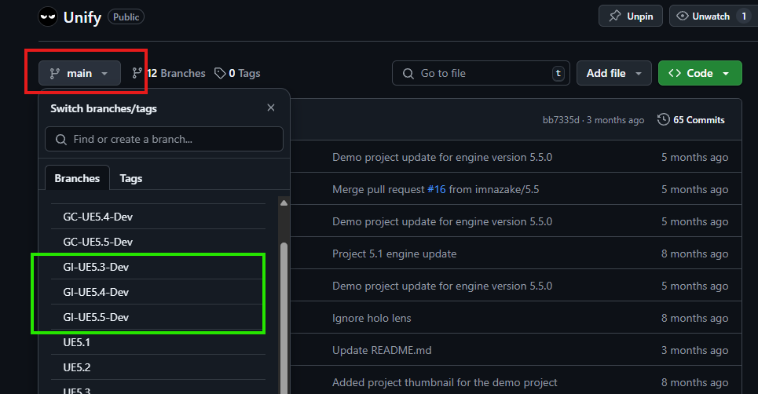

---

### 2. Download the Plugin  
- Obtain the plugin from the **Epic Games Launcher** or **Fab**.

---

### 3. Copy the Plugin to the Unify Demo Project  
- Navigate to the Unreal Engine directory where the plugin was installed.  
- Copy the plugin to the **Plugins** folder in the Unify demo project.  

---

### 4. Regenerate Visual Studio Solution Files  
- Regenerate the project solution files to ensure the plugin is integrated correctly.

---

### 5. Open the Project in Unreal Engine  
- Open the Unify demo project in Unreal Engine to proceed with further setup.

---

### 6. Create an Ability Set Data Asset  
- Navigate to the **Content Browser**.  
- Right-click and select **Miscellaneous > Data Asset**.  
- In the dialog box, select the appropriate class for the ability set (e.g., `UnifyAbilitySet`).  
- Name it `UAS_GameplayInteraction` or any name of your choice.  
- Refer to the image below for guidance.  


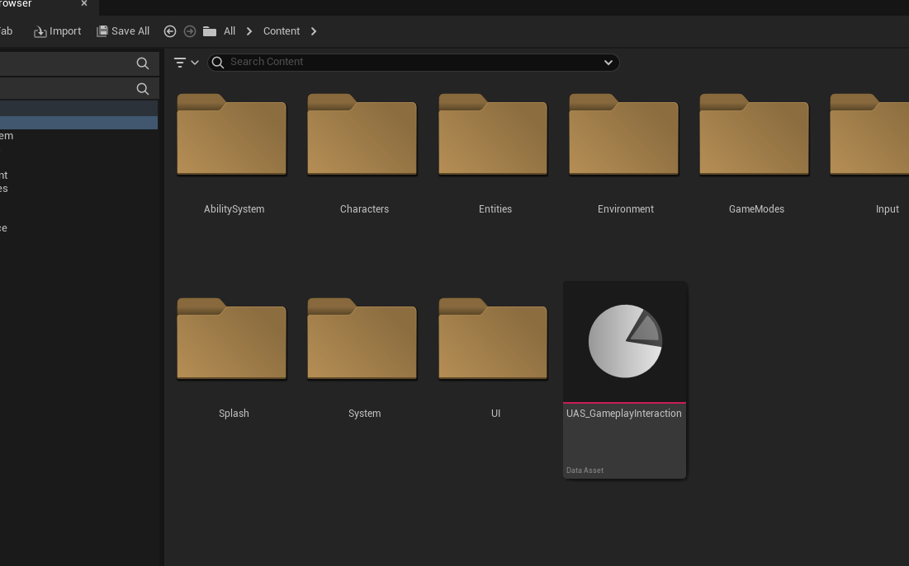 

---

### 7. Reparent the Abilities C++ Classes 
- You will need to open the project source code in your IDE to do this. 
- Go to **Tools > Open Rider (Or Visual Studio)**.  
- In your IDE navigate to `Plugins/GameplayInteraction/Source/GameplayInteraction/Public/Core/Abilities`
- Reparent the following ability classes:
      - **UGameplayAbility_Interact** > Parent (**UUnifyGameplayAbility**)
      - **UGameplayAbility_Interaction** > Parent (**UUnifyGameplayAbility**)
      - **UGameplayAbility_Interaction_ShowOptions** > Parent (**UUnifyGameplayAbility**)
- Add the required includes for the header files
      - Remove this include `#include "Abilities/GameplayAbility.h"`
      - Add this include instead `"AbilitySystem/Abilities/UnifyGameplayAbility.h"` 
- Add the `Unify` module name in `GameplayInteraction.Build.cs` in `PublicDependencyModuleNames`
- Save all changes, close the unreal editor and then recompile again and launch the editor.

:::warning Avoid Circular Dependency Issues

To prevent circular dependency issues in your project, it is recommended to **move the ability classes** from the plugin source folder:

```
Plugins/GameplayInteraction/Source/GameplayInteraction/Public/Core/Abilities
```

into your **project source directory** where you have your own abilities.

Alternatively, you can:

- **Copy the ability classes**
- **Rename them** appropriately in your project
- Use these copies instead of referencing the original plugin ability classes

This approach is especially useful if:

- You have your **own subclass** of `UGameplayAbility`
- You want your abilities to **work consistently** with your project-specific code
- You want to **avoid reparenting** plugin classes directly, which often leads to circular dependencies and other complications

By using your own project-local versions of the abilities, you ensure better integration and avoid tight coupling with the plugin.
:::

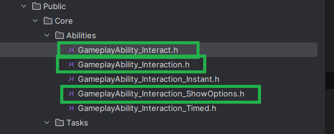
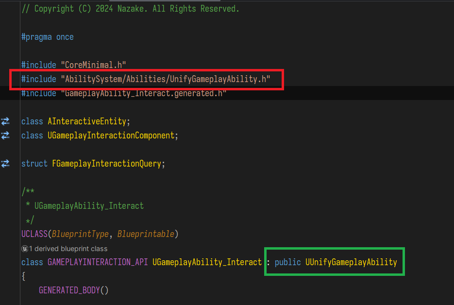
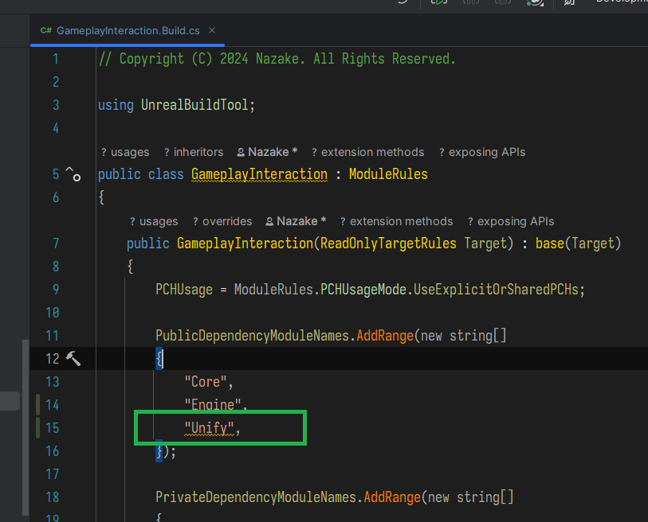

---

### 8. Add Abilities to the Ability Set  
- Open your `UAS_GameplayInteraction` ability set you created earlier.
- Add the following abilities:
      - **GA_Interact**
      - **GA_Interact_ShowOptions**
- Also configure input tags, refer to the image below

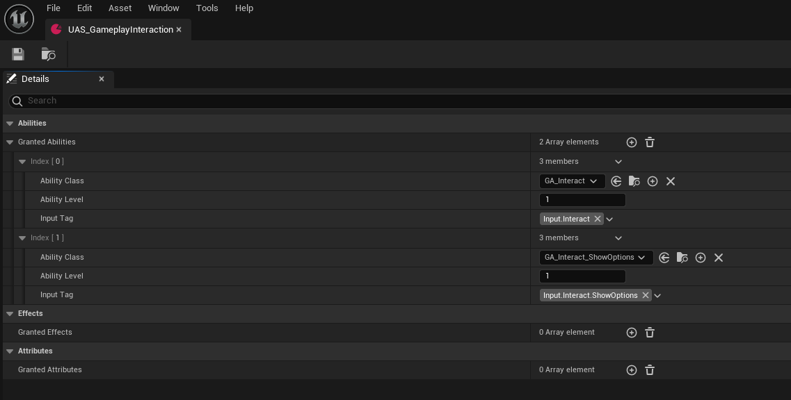


---

### 9. Add the Ability Set and the Input Config for Gameplay Interaction plugin  
1. **Add the Ability Set to the Character Blueprint:**  
   - Open the **Character Blueprint class**.  
   - Find the **AbilitySets** array.  
   - Add the `UAS_GameplayInteraction` (or your custom ability set) to the array.  
   - Save the blueprint.  


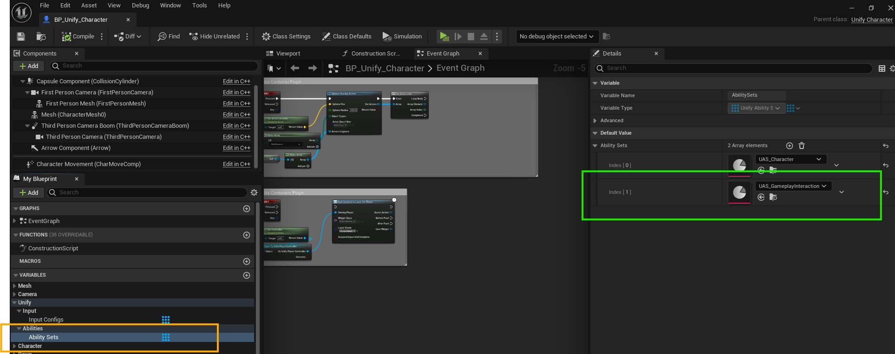

2. **Create And Add An Input Config to the Character Blueprint:** 
   - Navigate to the **Content Browser**.  
   - Right-click and select **Miscellaneous > Data Asset**.  
   - In the dialog box, select the appropriate class for the ability set (e.g., `UnifyInputConfig`).  
   - Name it `UIC_GameplayInteraction` or any name of your choice.  
   - Refer to the image below for guidance.  
   - Open the `UIC_GameplayInteraction` and add the following configs to it (refer to the images below).
         - `IA_Interact` with input tag `Input.Interact`
         - `IA_Interact_ShowOptions` with input tag `Input.Interact.ShowOptions` 
   - Open the **Character Blueprint class**.  
   - Find the **InputConfigs** array.  
   - Add the `UIC_GameplayInteraction` (or your custom input config) to the array.  
   - Save the blueprint.  

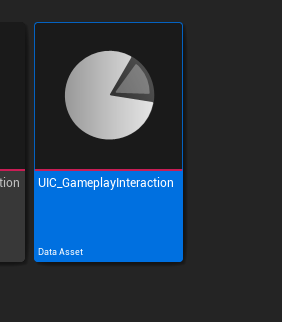
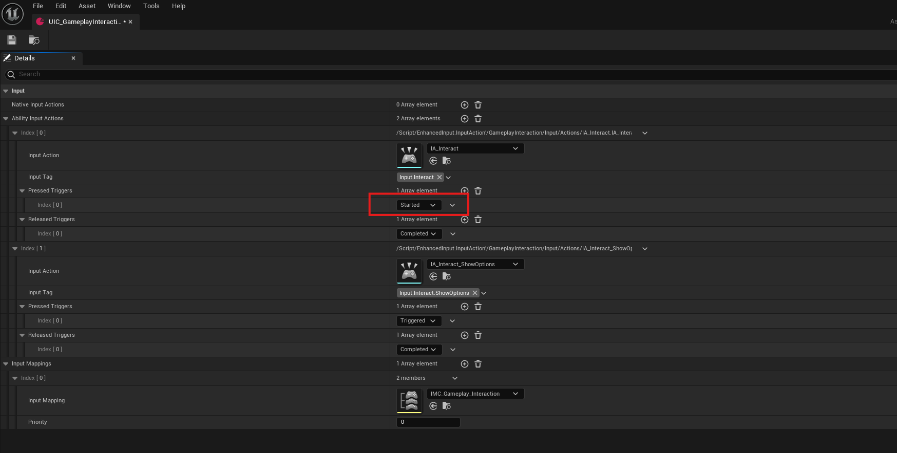
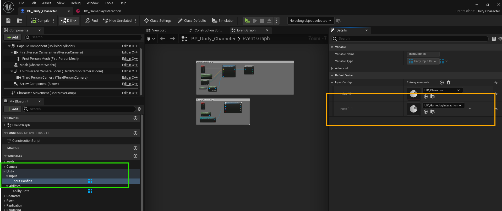

3. **Configure the Interact gameplay ability:** 
   - In UE Editor navigate to `Plugins > GameplayInteraction Content > Core > Abilities`
   - Open **GA_Interact** ability blueprint
   - Make sure the ability `Activation Policy` is set to `OnSpawn`
   - Save all changes

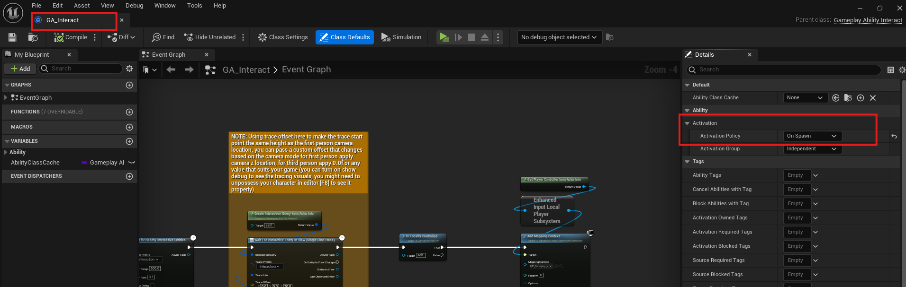

---

### 10. Test the Plugin  
- Press the **Play** button to test the functionality of the plugin in the project.

---

You’re all set! If you encounter any issues, refer to the plugin documentation or contact support.  